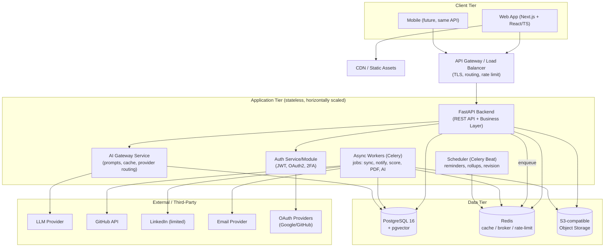
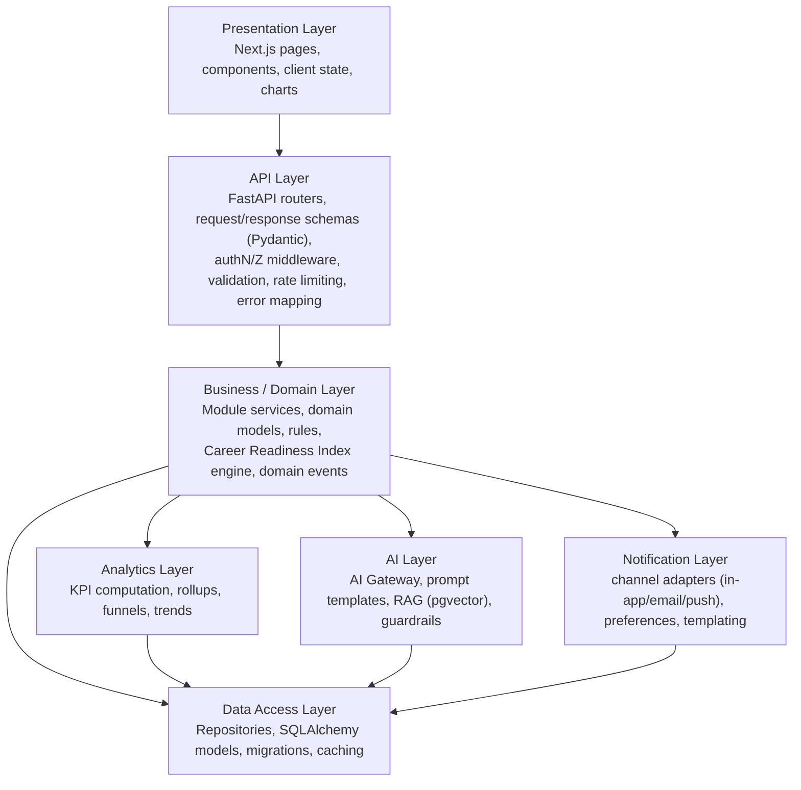
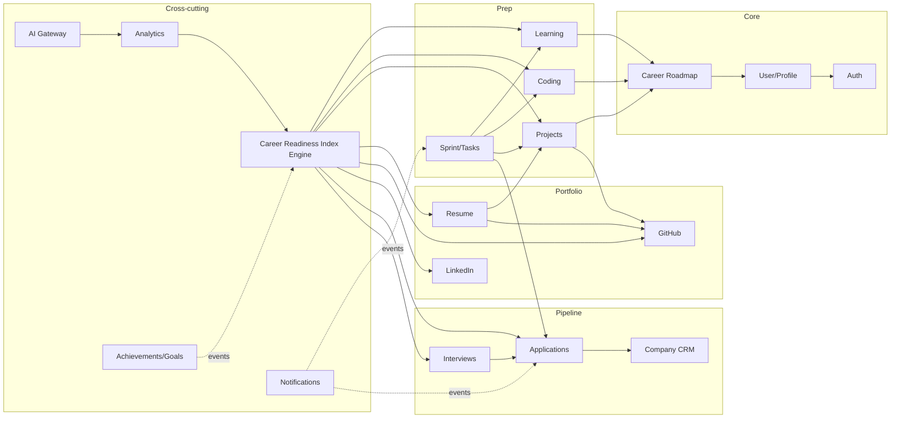
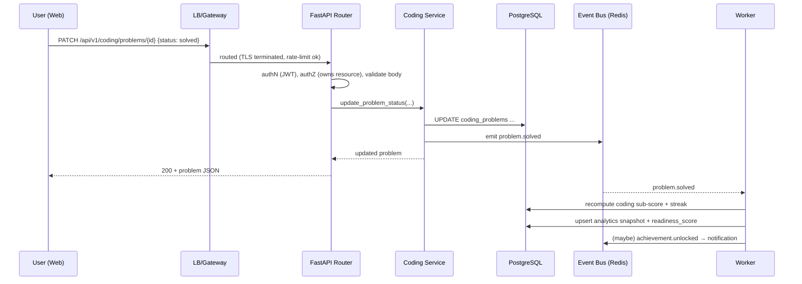
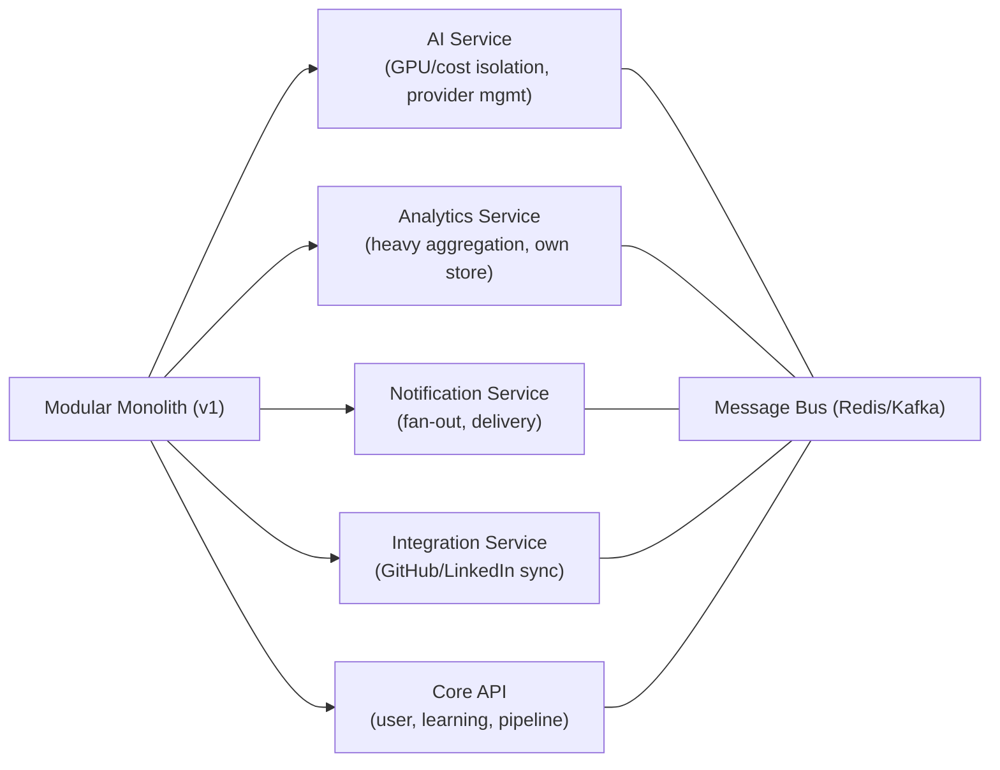

# 02 — Software Architecture

> Diagrams use **Mermaid** so they render in GitHub/most Markdown viewers.

## 2.1 Architectural principles

1. **Modular monolith first, microservices-ready.** One deployable API composed of clearly bounded modules with explicit interfaces. Boundaries are drawn so that AI, Analytics, Notifications, and Integrations can be extracted later without rewrites.
2. **Layered & dependency-directed.** Presentation → API → Business (domain services) → Data. Dependencies point inward; the domain layer never imports web/ORM specifics directly (repository interfaces isolate persistence).
3. **API-first.** Every capability is exposed through a versioned REST API documented via OpenAPI. The web client is just the first consumer (mobile later).
4. **Async by default for heavy work.** AI calls, third-party sync, notifications, PDF generation, and analytics rollups run on background workers.
5. **Stateless services.** No in-process session state; horizontal scale behind a load balancer. State lives in Postgres/Redis/object storage.
6. **Event-oriented internals.** Domain events (`application.status_changed`, `topic.mastered`, `problem.solved`) trigger score recomputation, notifications, and analytics — decoupling producers from consumers.
7. **Secure & observable by construction.** RBAC, input validation, encryption, structured logging, metrics, tracing, and audit trails are cross-cutting concerns, not afterthoughts.

---

## 2.2 High-level system diagram



---

## 2.3 Layered (logical) architecture



### Layer responsibilities

**Frontend (Presentation).** Next.js app router; server components for data-heavy pages; client components for interactivity. Server-state via TanStack Query (caching, optimistic updates); light UI state via Zustand. Design system with Tailwind + shadcn/ui. Charts via Recharts/D3. Auth tokens in httpOnly cookies; all data via the REST API.

**Backend (API Layer).** FastAPI routers grouped by module, each versioned under `/api/v1`. Responsibilities: authentication/authorization middleware, request validation (Pydantic), response serialization, pagination/filtering, rate limiting, consistent error envelope, OpenAPI generation. No business logic here — routers delegate to services.

**Authentication.** JWT access (short-lived) + refresh (rotating, httpOnly cookie). OAuth2 (Google/GitHub). Optional TOTP 2FA. Argon2 password hashing. Issues/validates tokens, manages sessions/refresh rotation, enforces RBAC scopes. (Details in doc 11.)

**Database.** PostgreSQL as system of record; JSONB for flexible/semi-structured fields (e.g., resume section content, KPI blobs); pgvector for embeddings. Alembic migrations. Read replicas added under load.

**API Layer** (as above) — the contract boundary; see doc 05 for the full contract.

**Business Layer.** The heart: one service module per domain (Learning, Coding, Projects, Resume, GitHub, LinkedIn, Company, Application, Interview, Sprint, Goals, Achievements). Encapsulates rules and orchestrates repositories. Hosts the **Career Readiness Index engine** and emits **domain events**.

**Analytics Layer.** Consumes domain events and scheduled rollups to compute KPIs (streaks, coverage, funnel conversion, CRI sub-scores). Writes denormalized `analytics_snapshots` for fast dashboard reads; heavy aggregation runs in workers.

**Notification Layer.** Preference-aware dispatch across channels (in-app, email now; push later). Template engine; deduplication; quiet hours; delivery status tracking. Triggered by events and the scheduler (deadlines, revision, sprint reminders).

**AI Layer.** An **AI Gateway** service centralizes all LLM access: prompt templates, context assembly (RAG over user data via pgvector), provider routing/fallback, response caching, cost/rate controls, output guardrails/validation, and PII redaction. Business services call the gateway; they never call the LLM directly. (Details in doc 10.)

**Future Scaling.** See §2.6.

---

## 2.4 Dependency diagram (module dependencies)



**Reading it:** Prep/Portfolio/Pipeline modules depend on Core (auth/user/roadmap). The **Score engine** reads from all activity modules. **Analytics** builds on the score + raw activity. **AI** consumes analytics + activity. **Notifications & Achievements** are event-driven consumers.

---

## 2.5 Request lifecycle (example: mark a coding problem solved)



---

## 2.6 Future scaling & microservices possibility

**Scaling levers (in order):**
1. Vertical + horizontal scaling of the stateless API behind the LB.
2. **Read replicas** for Postgres; move analytics reads to replicas; add connection pooling (PgBouncer).
3. **Caching** hot reads (dashboard, score) in Redis; CDN for static/SSG.
4. **Partition/scale workers** by queue (ai, integrations, notifications, analytics).
5. **Table partitioning** for high-volume time-series (`analytics_snapshots`, `notifications`, `coding_problems`).
6. **Search extraction** to OpenSearch when FTS becomes a bottleneck.

**Microservices extraction path** — extract along existing module seams when a domain needs independent scaling/ownership:



Extraction candidates (highest value first): **AI**, **Analytics**, **Notifications**, **Integrations** — each already isolated behind an interface and event-driven, so extraction is "deploy separately + swap in-process call for network call." A shared contracts package and the event bus keep coupling low. Kafka replaces Redis pub/sub when durability/replay is needed.

---

## 2.7 Environments

| Env | Purpose | Notes |
|-----|---------|-------|
| **local** | Dev | Docker Compose: api, worker, postgres, redis, minio, mailhog. |
| **preview** | Per-PR ephemeral | Auto-deployed by CI for review. |
| **staging** | Pre-prod | Mirrors prod; seeded data; runs E2E. |
| **production** | Live | HA Postgres, autoscaled API/workers, backups, monitoring. |

---

## 2.8 Folder structure

Monorepo (pnpm/turborepo for JS, uv/poetry for Python) so shared contracts live in one place.

```
placement-management-system/
├─ docs/                              # this documentation set
├─ apps/
│  ├─ web/                            # Next.js frontend
│  │  ├─ app/                         # app router: routes/layouts
│  │  │  ├─ (auth)/login, register
│  │  │  ├─ (app)/dashboard/
│  │  │  ├─ (app)/learning/
│  │  │  ├─ (app)/coding/
│  │  │  ├─ (app)/projects/
│  │  │  ├─ (app)/resume/
│  │  │  ├─ (app)/companies/ applications/ interviews/
│  │  │  ├─ (app)/sprint/ analytics/ coach/
│  │  │  └─ (app)/settings/
│  │  ├─ components/                  # ui/ (design system), charts/, forms/, layout/
│  │  ├─ features/                    # feature modules (hooks, api clients, views)
│  │  ├─ lib/                         # api client, auth, utils, query config
│  │  ├─ store/                       # zustand stores
│  │  ├─ styles/                      # tailwind, themes (light/dark tokens)
│  │  └─ tests/                       # vitest + RTL, playwright e2e
│  └─ api/                            # FastAPI backend
│     ├─ app/
│     │  ├─ main.py                   # app factory, middleware wiring
│     │  ├─ core/                     # config, security, logging, errors, deps
│     │  ├─ api/v1/                   # routers per module + router aggregation
│     │  ├─ modules/                  # domain modules (one folder each)
│     │  │  ├─ auth/                  # service.py, schemas.py, models.py, repo.py, router.py
│     │  │  ├─ users/  roadmap/
│     │  │  ├─ learning/ coding/ projects/ sprint/
│     │  │  ├─ resume/ github/ linkedin/
│     │  │  ├─ company/ application/ interview/
│     │  │  ├─ scoring/               # Career Readiness Index engine
│     │  │  ├─ analytics/ notifications/ achievements/ goals/
│     │  │  └─ ai/                    # AI gateway client, prompts, RAG
│     │  ├─ db/                       # session, base, mixins
│     │  ├─ events/                   # event bus, handlers
│     │  └─ workers/                  # celery app, tasks, beat schedules
│     ├─ migrations/                  # alembic
│     └─ tests/                       # pytest (unit/integration/api)
├─ packages/
│  ├─ contracts/                      # OpenAPI spec + generated TS types (shared)
│  ├─ ui-tokens/                      # design tokens (colors, spacing, typography)
│  └─ config/                         # shared lint/tsconfig/eslint/ruff configs
├─ infra/
│  ├─ docker/                         # Dockerfiles (web, api, worker)
│  ├─ compose/                        # docker-compose.*.yml
│  ├─ k8s/ or helm/                   # manifests/charts
│  └─ terraform/                      # cloud IaC
├─ .github/workflows/                 # CI/CD pipelines
├─ docker-compose.yml
└─ README.md
```

**Module convention (backend).** Each `modules/<name>/` contains: `models.py` (ORM), `schemas.py` (Pydantic I/O), `repo.py` (data access), `service.py` (business logic), `router.py` (HTTP), `events.py` (emitted/handled events), `tests/`. This keeps a module self-contained and extraction-ready.
