# 03 — Database Design

Relational, PostgreSQL 16. Normalized to **3NF** with deliberate, documented denormalization for analytics reads. All tables carry `id` (UUID PK), `created_at`, `updated_at`; user-owned tables carry `user_id` FK for tenant isolation; user-recoverable entities carry `deleted_at` (soft delete).

## 3.1 Design conventions

- **PK:** `id UUID DEFAULT gen_random_uuid()` on every table.
- **Tenant scoping:** every user-owned row has `user_id UUID NOT NULL REFERENCES users(id)`. All queries filter by `user_id` (enforced in the repository layer; optionally Postgres RLS).
- **FKs:** `ON DELETE CASCADE` for owned children (e.g., delete user → delete their data); `ON DELETE SET NULL` for optional cross-links (e.g., resume version referenced by an application).
- **Enums:** Postgres `ENUM` types for stable, closed value sets (status, difficulty, level).
- **Timestamps:** `TIMESTAMPTZ`, UTC.
- **Money/scores:** `NUMERIC` for CTC/scores; percentages stored 0–100.
- **Flexible content:** `JSONB` for resume section bodies, KPI blobs, integration payloads (with GIN indexes where queried).
- **Auditing:** `created_at`/`updated_at` via trigger; sensitive tables logged to `audit_logs`.

---

## 3.2 Entity Relationship Diagram

```mermaid
erDiagram
  USERS ||--o{ USER_ROLES : has
  ROLES ||--o{ USER_ROLES : assigned
  USERS ||--|| PROFILES : has
  USERS ||--o{ CAREER_ROADMAPS : owns
  CAREER_ROADMAPS ||--o{ ROADMAP_MILESTONES : contains
  TARGET_ROLES ||--o{ CAREER_ROADMAPS : targets

  USERS ||--o{ USER_DOMAINS : tracks
  LEARNING_DOMAINS ||--o{ TOPICS : contains
  TOPICS ||--o{ SUB_TOPICS : contains
  LEARNING_DOMAINS ||--o{ USER_DOMAINS : referenced
  USERS ||--o{ TOPIC_PROGRESS : records
  TOPICS ||--o{ TOPIC_PROGRESS : progressed
  SUB_TOPICS ||--o{ TOPIC_PROGRESS : progressed
  TOPIC_PROGRESS ||--o{ REVISION_SCHEDULE : schedules
  RESOURCES }o--o{ TOPICS : "linked via TOPIC_RESOURCES"

  USERS ||--o{ CODING_PROBLEMS : logs
  TOPICS ||--o{ CODING_PROBLEMS : categorizes

  USERS ||--o{ PROJECTS : owns
  PROJECTS ||--o{ MILESTONES : has
  PROJECTS ||--o{ TASKS : has
  MILESTONES ||--o{ TASKS : groups
  PROJECTS }o--|| GITHUB_REPOSITORIES : "may link"

  USERS ||--o{ SPRINTS : plans
  SPRINTS ||--o{ TASKS : contains
  USERS ||--o{ DAILY_TASKS : "aggregated view"
  USERS ||--o{ WEEKLY_REVIEWS : writes

  USERS ||--o{ RESUME_VERSIONS : maintains
  RESUME_VERSIONS ||--o{ RESUME_SECTIONS : contains

  USERS ||--o{ GITHUB_REPOSITORIES : syncs
  USERS ||--|| LINKEDIN_PROFILES : tracks
  LINKEDIN_PROFILES ||--o{ NETWORKING_ACTIVITIES : logs

  USERS ||--o{ COMPANIES : saves
  COMPANIES ||--o{ COMPANY_CONTACTS : has
  COMPANIES ||--o{ APPLICATIONS : receives
  USERS ||--o{ APPLICATIONS : submits
  APPLICATIONS ||--o{ INTERVIEWS : leads_to
  APPLICATIONS }o--|| RESUME_VERSIONS : "used"
  INTERVIEWS ||--o{ INTERVIEW_QUESTIONS : contains

  USERS ||--o{ GOALS : sets
  USERS ||--o{ ACHIEVEMENTS : earns
  USERS ||--o{ NOTIFICATIONS : receives
  USERS ||--o{ ANALYTICS_SNAPSHOTS : has
  USERS ||--o{ READINESS_SCORES : has
  USERS ||--o{ AI_INTERACTIONS : has
```

---

## 3.3 Tables & rationale

> "Why it exists" is stated for each, as requested. Full DDL in [doc 04](04-database-schema.sql).

### Identity & access
- **users** — Core identity (email, hashed password, status, auth metadata). *Why:* the tenant root; everything hangs off a user.
- **roles**, **user_roles** — RBAC role catalog and the many-to-many assignment. *Why:* separate role definitions from users so permissions scale (student, admin, coach, institution_admin) without schema churn.
- **profiles** — 1:1 extended user info (name, avatar, college, branch, grad year, target date, headline). *Why:* keeps the hot `users` auth table lean while storing profile/PII separately.
- **auth_sessions / refresh_tokens** — Refresh-token rotation & device sessions. *Why:* secure, revocable sessions and logout-everywhere.

### Career targeting
- **target_roles** — Catalog of supported roles (Data Engineer, Data Analyst, …) with skill weightings. *Why:* drives roadmaps, recommendations, and role-weighted scoring; centralizing lets admins tune without code.
- **career_roadmaps** — A user's chosen role path (active flag, target date). *Why:* a user may explore/switch roles; each roadmap is a first-class, trackable plan.
- **roadmap_milestones** — Ordered milestones within a roadmap (e.g., "Master SQL joins", "Ship ETL project"). *Why:* turns an abstract role into concrete, checkable steps that link to learning/projects.

### Learning (LMS)
- **learning_domains** — Top-level subjects (Python, SQL, DSA, Excel, Power BI, Pandas, NumPy, Statistics, Data Engineering, AI, Communication, Aptitude). *Why:* canonical, admin-curated taxonomy shared across users.
- **topics** — Children of a domain. **sub_topics** — Children of a topic. *Why:* hierarchical curriculum enables granular progress, coverage analytics, and coding-problem categorization.
- **user_domains** — Per-user tracking of which domains they're pursuing + weighting/priority. *Why:* users don't study all domains equally; supports role-based prioritization.
- **topic_progress** — Per-user status/mastery per topic/sub-topic (status, mastery %, confidence, last_reviewed). *Why:* the atomic learning record; feeds CRI learning sub-score and revision scheduling.
- **revision_schedule** — Spaced-repetition entries (due_date, interval, ease). *Why:* enforces retention; generates revision tasks/notifications.
- **resources**, **topic_resources** — Learning materials (video/article/course) and their M:N link to topics. *Why:* attach curated/personal materials to topics without duplicating; reusable across users.

### Coding tracker
- **coding_problems** — Logged problems (title, platform, url, difficulty, topic_id, status, time_spent, revisit, solved_at, notes). *Why:* the practice ledger; powers streaks, heatmaps, topic coverage, and coding sub-score.

### Projects
- **projects** — Portfolio projects (title, description, tech stack, status, repo link, live url, role_relevance). *Why:* projects are core employability signals and resume evidence.
- **milestones** — Project milestones (also used by roadmaps conceptually but scoped to project here). *Why:* break projects into shippable increments.
- **tasks** — Unit of execution used by Projects and Sprints (title, status, priority, type, due, estimate, links to project/milestone/sprint/domain/application). *Why:* one flexible task entity powers the Kanban board, sprint planner, and daily view — avoids three near-duplicate tables.

### Sprint & reviews
- **sprints** — Time-boxed plans (name, start/end, goal, status). *Why:* structures execution and enables velocity/completion analytics.
- **daily_tasks** — Materialized "today" view / daily plan entries (or a query view). *Why:* fast daily dashboard and daily completion tracking without scanning all tasks.
- **weekly_reviews** — Reflection + metrics snapshot + next-week plan (JSONB). *Why:* the reflection loop that drives re-planning and keeps history.

### Resume (ATS)
- **resume_versions** — Each tailored resume (name, target_role, ats_score, keyword_coverage, is_primary, file_key). *Why:* students tailor per role/company; versioning enables A/B and ATS tracking over time.
- **resume_sections** — Structured section content (type, order, JSONB body). *Why:* structured storage enables ATS parsing, reordering, and export without free-text blobs.

### Portfolio integrations
- **github_repositories** — Synced repos (name, url, languages JSONB, stars, commits, last_pushed). *Why:* objective portfolio/activity signal; feeds GitHub sub-score and resume evidence.
- **linkedin_profiles** — 1:1 tracked profile (url, completeness %, connections, followers). *Why:* professional brand signal; feeds LinkedIn sub-score.
- **networking_activities** — Logged outreach/posts/connections. *Why:* networking is a leading indicator of referrals/interviews; trackable actions drive nudges.

### Placement pipeline (CRM)
- **companies** — Saved target companies (name, industry, location, size, ctc_band, priority, source, website). *Why:* CRM root; one company can have many applications/contacts over time.
- **company_contacts** — Recruiters/referrers per company (name, role, email, linkedin, notes). *Why:* referrals and follow-ups need contact records; separate table = many contacts per company.
- **applications** — Application per company (role_title, status, applied_at, deadline, source, resume_version_id, ctc, location, notes). *Why:* the funnel's core object; central to placement analytics and reminders.
- **interviews** — Rounds per application (round_no, type, scheduled_at, mode, status, self_rating, outcome, feedback). *Why:* interview performance tracking and prep feedback loop.
- **interview_questions** — Questions asked in an interview (text, category, difficulty, self_rating, answer_notes). *Why:* builds a personal question bank for revision and mock-interview seeding.

### Engagement
- **goals** — SMART goals (title, metric, target_value, current_value, due, status, linked_entity). *Why:* explicit objectives beyond implicit tracking; drives motivation & AI planning.
- **achievements** — Earned badges/streaks (code, title, earned_at, meta). *Why:* gamification/retention; decoupled catalog + earned instances.

### Cross-cutting
- **notifications** — Per-user messages (type, channel, title, body, entity ref, read_at, sent_at, status). *Why:* unified inbox + delivery tracking across channels.
- **analytics_snapshots** — Denormalized periodic KPI rollups per user (period, JSONB metrics). *Why:* dashboards must be fast; precomputing avoids expensive live aggregation.
- **readiness_scores** — Time series of CRI + sub-scores (JSONB breakdown, computed_at). *Why:* the North-Star metric needs history for trend charts and prediction features.
- **ai_interactions** — Log of AI requests/responses (feature, prompt_ref, tokens, cost, rating). *Why:* cost control, quality feedback, safety audit, and improving prompts.
- **audit_logs** — Security-relevant actions (actor, action, entity, ip, meta). *Why:* compliance, forensics, and admin accountability.
- **embeddings** (pgvector) — Vector store for RAG over user content (owner_type, owner_id, vector, chunk). *Why:* powers grounded AI (resume review, coaching) using the user's own data.

---

## 3.4 Key relationships (cardinality summary)

| Relationship | Type | Delete rule |
|--------------|------|-------------|
| users → profiles | 1:1 | cascade |
| users → * (all owned) | 1:N | cascade |
| roles ↔ users | M:N via user_roles | cascade |
| learning_domains → topics → sub_topics | 1:N chained | cascade |
| topics ↔ resources | M:N via topic_resources | cascade on link |
| topic_progress → revision_schedule | 1:N | cascade |
| projects → milestones/tasks | 1:N | cascade |
| projects → github_repositories | N:1 (optional link) | set null |
| sprints → tasks | 1:N | set null (task survives sprint) |
| companies → applications | 1:N | cascade |
| companies → company_contacts | 1:N | cascade |
| applications → interviews | 1:N | cascade |
| applications → resume_versions | N:1 (optional) | set null |
| interviews → interview_questions | 1:N | cascade |
| target_roles → career_roadmaps | 1:N | restrict |
| career_roadmaps → roadmap_milestones | 1:N | cascade |

---

## 3.5 Normalization

- **1NF:** atomic columns; repeating groups (languages, KPI sets) isolated to child tables or typed JSONB where schema-flexible.
- **2NF:** no partial dependencies; composite-key link tables (`user_roles`, `topic_resources`) hold only the relationship + link attributes.
- **3NF:** non-key attributes depend only on the key (e.g., company attributes live on `companies`, not duplicated on `applications`; an application references `company_id`).
- **Deliberate denormalization:** `analytics_snapshots` and `readiness_scores` store precomputed JSONB for read performance; `applications` caches `company_name` optionally only in read projections, never as source of truth. `resume_versions.ats_score` is a cached computed value, recomputed on edit.

---

## 3.6 Indexing strategy

| Table | Indexes | Reason |
|-------|---------|--------|
| users | UNIQUE(email); INDEX(status) | login lookup, admin filters |
| profiles | UNIQUE(user_id) | 1:1 |
| topic_progress | INDEX(user_id, topic_id); INDEX(user_id, status); INDEX(user_id, last_reviewed) | progress queries, revision due |
| revision_schedule | INDEX(user_id, due_date) | daily "due revisions" |
| coding_problems | INDEX(user_id, solved_at); INDEX(user_id, topic_id); INDEX(user_id, status) | heatmap, coverage, filters |
| tasks | INDEX(user_id, status); INDEX(sprint_id); INDEX(due_date); INDEX(project_id) | boards, sprint, daily |
| applications | INDEX(user_id, status); INDEX(user_id, deadline); INDEX(company_id) | funnel, deadline reminders |
| interviews | INDEX(application_id); INDEX(user_id, scheduled_at) | upcoming interviews |
| companies | INDEX(user_id, priority); GIN(name gin_trgm) | CRM list, search |
| notifications | INDEX(user_id, read_at); INDEX(user_id, created_at) | inbox, unread badge |
| analytics_snapshots | UNIQUE(user_id, period, period_start) | idempotent rollups |
| readiness_scores | INDEX(user_id, computed_at) | trend chart |
| embeddings | IVFFLAT/HNSW on vector | ANN search for RAG |
| resources/topics | GIN(to_tsvector) | full-text search |

Composite indexes are ordered `(user_id, <filter/sort col>)` because every query is tenant-scoped first.

---

## 3.7 Future scalability (data)

- **Partitioning:** range-partition `analytics_snapshots`, `notifications`, `readiness_scores`, `coding_problems` by month for retention/pruning and query pruning.
- **Read replicas:** route analytics/dashboard reads to replicas.
- **Archival:** move stale notifications/AI logs to cold storage after N months.
- **RLS:** enable Postgres Row-Level Security keyed on `user_id` (defense-in-depth for multi-tenant).
- **Sharding (far future):** shard by `user_id` hash if a single cluster is outgrown; module-aligned services can own their own databases post-extraction.
- **JSONB → columns:** promote frequently-queried JSONB keys to real columns with indexes as access patterns solidify.
