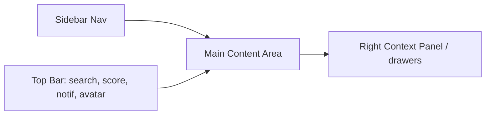

# 06 — UI/UX Design

Design language: clean, data-dense but calm; card-based; keyboard-first power features; accessible (WCAG 2.1 AA). Built on **Tailwind + shadcn/ui (Radix)**; charts via **Recharts**. Fully responsive, dark/light themed.

## 6.1 Information architecture & navigation

```
Top bar:  [Logo] [Global Search ⌘K]        [Score pill] [Notifications] [Avatar ▾]
Sidebar (collapsible, icon+label):
  ▸ Dashboard
  ▸ Sprint            (Planner, Daily, Weekly Review)
  ▸ Learning
  ▸ Coding
  ▸ Projects
  ▸ Resume
  ▸ Portfolio         (GitHub, LinkedIn)
  ▸ Pipeline          (Companies, Applications, Interviews)
  ▸ Analytics
  ▸ AI Coach
  ─────────
  ▸ Goals & Achievements
  ▸ Settings
```

- **Sidebar:** collapsible to icon-rail; sections grouped (Plan / Prepare / Portfolio / Pipeline / Insight). Active route highlighted; nested items expand.
- **Top bar:** persistent **Career Readiness Index pill** (click → score breakdown popover), notifications bell (unread badge), global search / command palette (`⌘K` / `Ctrl+K`), avatar menu (profile, theme toggle, logout).
- **Breadcrumbs** on deep pages; **contextual action bar** (right side) for primary CTAs.
- **Mobile:** sidebar becomes a bottom tab bar (Dashboard, Sprint, Pipeline, Analytics, More) + slide-over menu.



## 6.2 Page inventory

| Route | Page | Key elements |
|-------|------|--------------|
| `/dashboard` | Career Dashboard | Score ring, today's tasks, funnel widget, deadlines, streak, AI nudge, quick actions |
| `/sprint` | Sprint Planner | Sprint header, Kanban board, backlog, burndown |
| `/sprint/daily` | Daily | Today's task list, focus timer, quick-add |
| `/sprint/weekly-review` | Weekly Review | Metrics recap, reflection form, next-week planner |
| `/learning` | Learning | Domain cards grid, mastery rings, revision-due panel |
| `/learning/domains/{id}` | Domain detail | Topic list w/ progress bars, resources, notes |
| `/coding` | Coding Tracker | Heatmap calendar, coverage radar, problem table, revisit queue |
| `/projects` | Projects | Project cards, Kanban, milestone timeline |
| `/projects/{id}` | Project detail | Overview, tasks, milestones, linked repo |
| `/resume` | Resume Studio | Version list, editor (sections), live preview, ATS panel |
| `/portfolio/github` | GitHub | Repo cards, language chart, contribution heatmap |
| `/portfolio/linkedin` | LinkedIn | Completeness ring, networking log |
| `/pipeline/companies` | Company CRM | Company table/cards, contacts, priorities |
| `/pipeline/applications` | Applications | Funnel board (Kanban by status), table, deadlines |
| `/pipeline/interviews` | Interviews | Calendar + list, round detail, question bank |
| `/analytics` | Analytics hub | Tabbed dashboards (see doc 09) |
| `/coach` | AI Career Coach | Chat, suggested prompts, action cards, mock-interview launcher |
| `/goals` | Goals & Achievements | Goal cards + progress, badge shelf |
| `/settings` | Settings | Profile, preferences, theme, notifications, integrations, privacy, danger zone |

## 6.3 Component library (design system)

**Primitives (shadcn/ui):** Button, Input, Select, Combobox, Checkbox, Switch, Tabs, Tooltip, Popover, Dropdown, Dialog/Modal, Sheet/Drawer, Toast, Badge, Avatar, Skeleton, Progress, Accordion, Command palette.

**Composite / domain components:**
- **Cards:** `MetricCard` (label, value, delta, sparkline), `EntityCard` (project/company/repo), `TaskCard` (drag handle, priority, due, type icon), `ScoreRingCard`.
- **Charts:** `ProgressRing`, `LineChart`, `BarChart`, `RadarChart`, `Heatmap` (calendar), `FunnelChart`, `DonutChart`, `Sparkline`.
- **Widgets:** `TodaysTasksWidget`, `DeadlinesWidget`, `StreakWidget`, `FunnelWidget`, `AINudgeWidget`, `RevisionDueWidget`.
- **Tables:** `DataTable` (sort, filter, paginate, column visibility, row actions, bulk select, empty state).
- **Kanban:** `KanbanBoard` (columns, drag-drop cards, WIP counts) — reused by Sprint, Projects, Applications.
- **Forms:** `FormField` (label, control, error, hint), `DateRangePicker`, `TagInput`, `RichTextEditor` (resume/notes), `FileUpload` (presigned).
- **Timeline:** `Timeline` (milestones, interview rounds), `Burndown`.
- **Calendar:** `CalendarView` (interviews, deadlines, revision).
- **Dialogs:** create/edit modals per entity, confirm-destructive dialog, ATS-scan dialog, status-transition dialog.
- **Feedback:** `EmptyState`, `ErrorState`, `LoadingSkeletons`, `Toast` notifications.

## 6.4 Key screen wireframes (ASCII)

**Career Dashboard**
```
┌───────────────────────────────────────────────────────────────┐
│  Good evening, Aarav      Target: Data Engineer · 128 days left │
├───────────────┬───────────────┬───────────────┬───────────────┤
│  CRI Ring 72 ▲3│ Streak 🔥 14d  │ Apps: 12       │ Interviews: 3 │
├───────────────┴───────────────┴───────────────┴───────────────┤
│  Today's Tasks (5)                    │  Application Funnel      │
│  ☐ Solve 2 DSA (graphs)               │  Saved 8 ▸ Applied 12 ▸  │
│  ☐ SQL window functions               │  OA 4 ▸ Int 3 ▸ Offer 1  │
│  ☐ Push ETL repo                      │                          │
│  [+ quick add]                        │  Upcoming Deadlines      │
├───────────────────────────────────────┤  • Google OA — 2d       │
│  AI Nudge: "Your GitHub sub-score is  │  • Amazon apply — 4d     │
│  lagging. Ship the ETL project this   │──────────────────────────│
│  sprint to lift CRI ~4 pts." [Plan it] │  Score breakdown (radar) │
└───────────────────────────────────────────────────────────────┘
```

**Applications (Funnel Kanban)**
```
Saved      Applied     OA          Interview   Offer      Rejected
┌───────┐  ┌───────┐   ┌───────┐   ┌───────┐   ┌───────┐  ┌───────┐
│Infosys│  │Google │   │Amazon │   │Zoho   │   │Acme   │  │X Corp │
│ SDE   │  │ DE    │   │ DE    │   │ DA    │   │ DE    │  │ DE    │
│ prio●│  │due 2d │   │       │   │int 5d │   │₹18LPA │  │       │
└───────┘  └───────┘   └───────┘   └───────┘   └───────┘  └───────┘
  (drag cards between columns → PATCH status)
```

**Resume Studio**
```
┌ Versions ┐ ┌──────── Editor ─────────┐ ┌──── ATS Panel ────┐
│ ● DE v3  │ │ [Summary] [Experience]  │ │ Score: 78 / 100   │
│   DA v1  │ │ [Projects] [Skills] ... │ │ ▓▓▓▓▓▓▓░░          │
│ + New    │ │  drag to reorder        │ │ Matched: sql, etl │
└──────────┘ │  rich-text section body │ │ Missing: airflow, │
             └─────────────────────────┘ │  spark  [Fix with │
             ┌ Live PDF preview ┐        │  AI]              │
             └──────────────────┘        └───────────────────┘
```

## 6.5 Theming — light & dark mode

- **Token-based** (CSS variables) so both themes share structure. Toggle in top bar/settings; persisted per user + respects `prefers-color-scheme`.
- **Palette (semantic tokens):**
  - `--bg`, `--surface`, `--surface-muted`, `--border`, `--text`, `--text-muted`
  - Brand: `--primary` (indigo/violet), `--accent` (teal)
  - Status: `--success` (green), `--warning` (amber), `--danger` (red), `--info` (blue)
  - Score gradient: red → amber → green mapped to 0–100.
- **Light:** near-white surfaces, subtle shadows, `--text` slate-900.
- **Dark:** slate-950 bg, slate-900 surfaces, elevated borders, reduced pure-white text (slate-100) to cut glare.
- **Typography:** Inter (UI), JetBrains Mono (code/metrics). Scale: 12/14/16/20/24/32.
- **Spacing:** 4px base grid; radius `lg` (12px) cards, `md` (8px) inputs.
- **Motion:** 150–200ms ease for hovers/drawers; respects `prefers-reduced-motion`.

## 6.6 Responsive design

| Breakpoint | Layout |
|-----------|--------|
| `< 640px` (mobile) | Single column; bottom tab bar; Kanban → horizontal scroll or stacked list; charts simplified; drawers full-screen. |
| `640–1024px` (tablet) | Collapsible sidebar (icon rail); 2-col grids; condensed tables. |
| `> 1024px` (desktop) | Full sidebar; multi-column dashboards; side context panels; full data tables. |

## 6.7 Accessibility & UX standards

- Full keyboard nav; visible focus rings; `⌘K`/`Ctrl+K` command palette; skip-to-content link.
- ARIA roles on interactive components (Radix provides most); color-contrast AA; never color-only status (icon + label).
- Loading = skeletons (not spinners) for perceived speed; optimistic updates for task/status changes with rollback on error.
- Consistent empty states with a primary CTA (e.g., "No applications yet — Add your first company").
- Error toasts include a `request_id` for support; destructive actions require confirm.
- Autosave for editors (resume/notes) with "saved" indicator.
