# 07 — User Journeys & Flows

Flow diagrams (Mermaid) for the primary end-to-end journey plus per-module flows.

## 7.1 Master daily journey

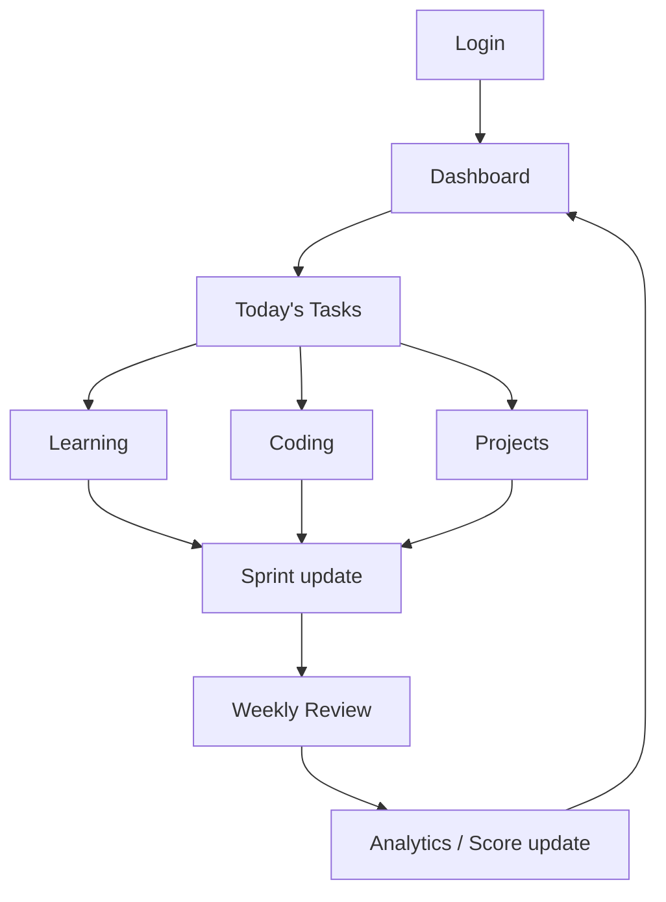

## 7.2 Onboarding & first-run

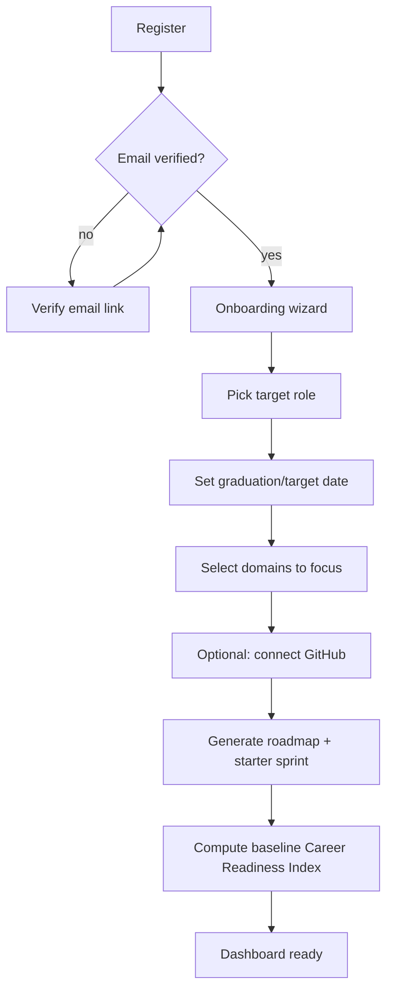

## 7.3 Authentication flow

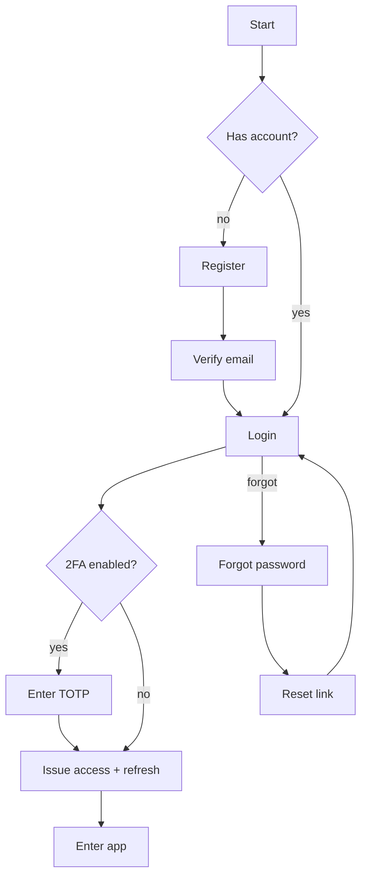

## 7.4 Learning module flow

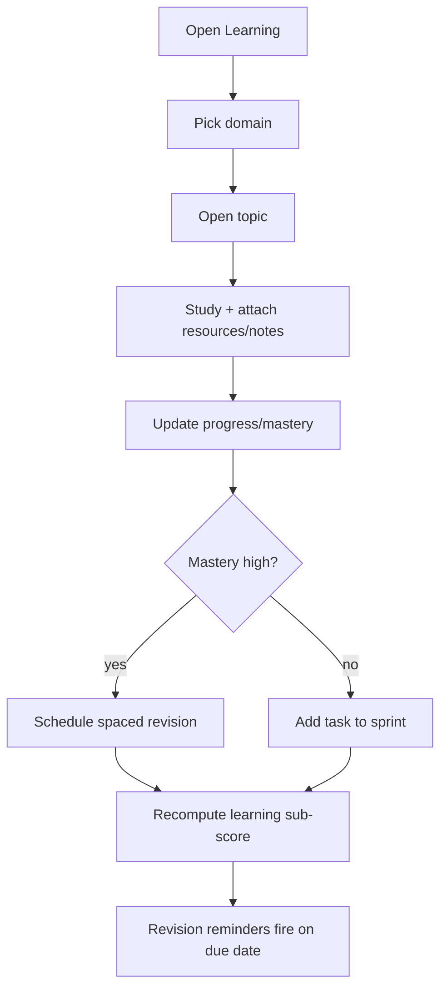

## 7.5 Coding tracker flow

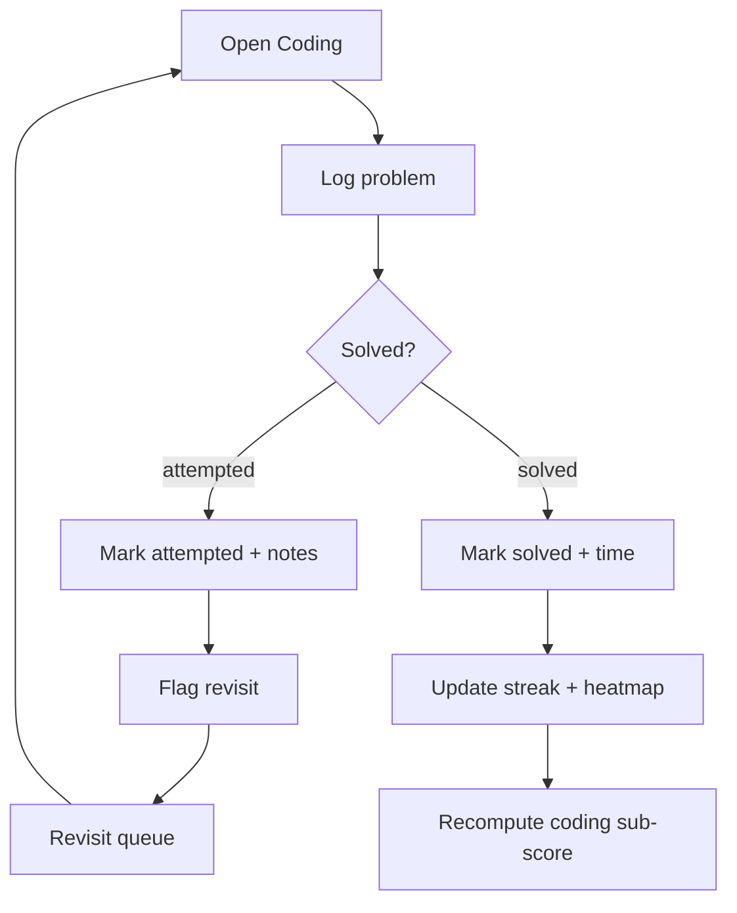

## 7.6 Projects flow

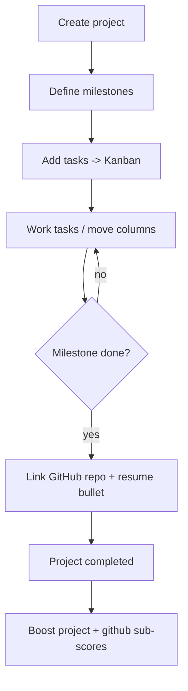

## 7.7 Resume + ATS flow

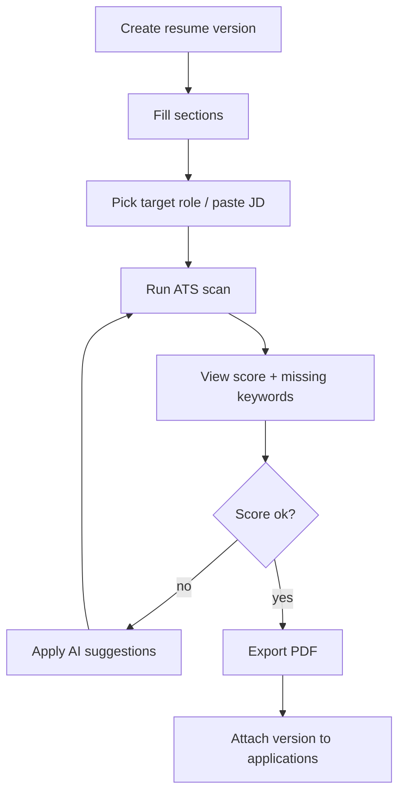

## 7.8 Company CRM → Application → Interview → Offer flow

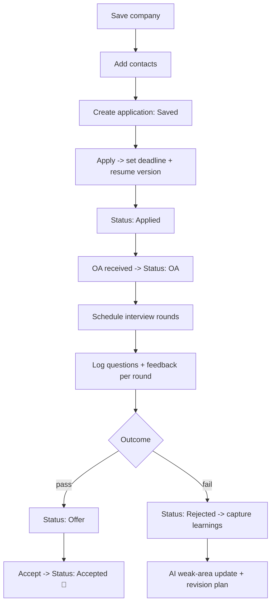

## 7.9 Sprint planning & daily execution flow

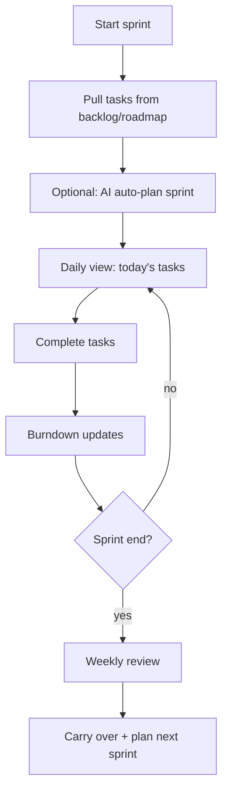

## 7.10 Weekly review flow

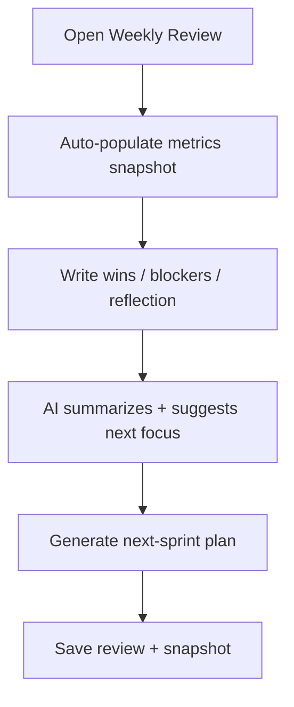

## 7.11 AI Career Coach flow

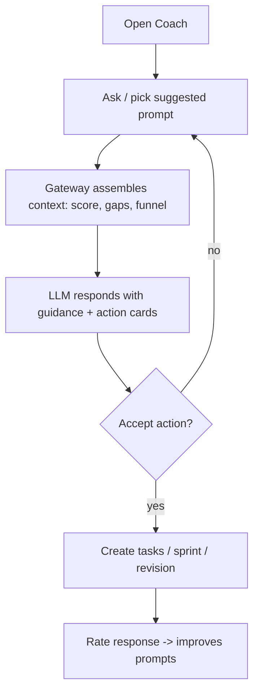

## 7.12 Notification lifecycle

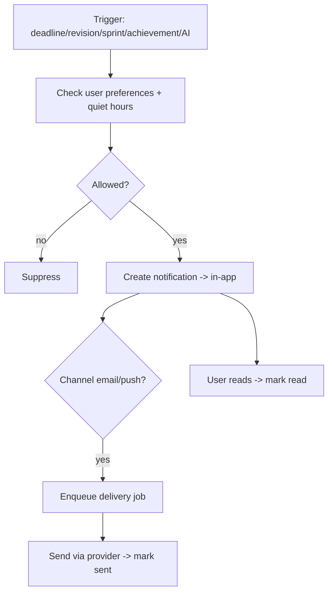

## 7.13 Career Readiness Index recompute (event-driven)

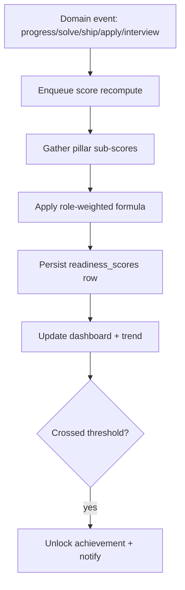
