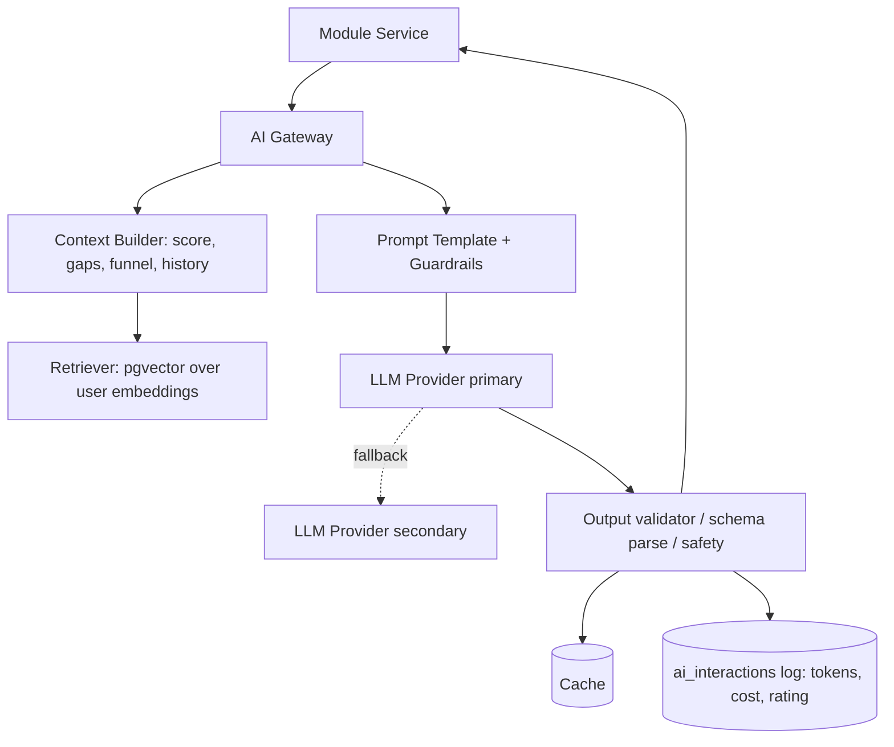

# 10 — AI Features

All AI runs through the **AI Gateway** (doc 02 §AI Layer): prompt templates, context assembly via RAG over the user's own data (pgvector `embeddings`), provider routing/fallback, response caching, cost/rate controls, output guardrails, and PII redaction. Business services never call the LLM directly.

## 10.1 AI architecture

**Cross-cutting AI principles:** grounded (RAG on user data, cite sources), structured (JSON-schema outputs for actionable cards), safe (guardrails, no fabricated commitments), cost-aware (cache, tiered gating, token budgets), measurable (every call logged + rated), and provider-agnostic (swap models behind the gateway).

---

## 10.2 Career Coach
- **What:** Conversational assistant answering "what should I do next / how do I improve / why is my score X".
- **Inputs:** User message + assembled context (CRI + breakdown, weak areas, funnel, deadlines, recent activity).
- **Outputs:** Grounded advice + **action cards** (create task/sprint/revision, open module) the user can accept in one click.
- **API:** `POST /me/ai/coach` (SSE streaming).
- **Guardrails:** no guaranteed-outcome claims; cite which data drove the advice.

## 10.3 Resume Review
- **What:** Structured critique of a resume version vs. target role/JD.
- **Inputs:** Resume sections (RAG), target role skill weights, optional JD.
- **Outputs:** Section-by-section feedback, impact/quantification suggestions, missing keywords, rewritten bullet suggestions, ATS alignment.
- **API:** `POST /me/ai/resume-review`; complements deterministic ATS scan (`/ats-scan`).
- **Output schema:** `{ overall, sections:[{type,issues[],suggestions[]}], missing_keywords[], rewrites[] }`.

## 10.4 Mock Interview
- **What:** Interactive AI interviewer (technical/behavioral/system-design) tailored to target role and logged weak areas.
- **Flow:** `start` (config: type, role, difficulty) → `turn` (Q→A→follow-up, adaptive) → `finish` (scored report).
- **Inputs:** Role, type, difficulty, personal question bank, weak areas.
- **Outputs:** Per-question scoring, model answers, communication feedback, overall rating, recommended revision → auto-added to sprint.
- **API:** `POST /me/ai/mock-interview/{start|turn|finish}`.

## 10.5 Learning Recommendation
- **What:** Suggests next topics/domains to study based on role gap, coverage, and time-to-target.
- **Inputs:** `topic_progress`, `target_roles.skill_weights`, coverage, deadline.
- **Outputs:** Ranked topic list with rationale + "add to sprint" actions.
- **API:** `GET /me/ai/recommendations?type=learning`.

## 10.6 Revision Recommendation
- **What:** Prioritizes what to revise now, blending spaced-repetition due-dates with confidence and recency.
- **Inputs:** `revision_schedule`, `topic_progress.confidence/last_reviewed`, interview misses.
- **Outputs:** Ordered revision queue with reasons; feeds daily plan.
- **API:** `GET /me/ai/recommendations?type=revision`.

## 10.7 Weak-Area Detection
- **What:** Identifies weakest pillars/topics/interview types from multi-signal analysis.
- **Inputs:** Coding coverage/accuracy, low-mastery topics, low interview self-ratings/outcomes by type, funnel drop-offs.
- **Outputs:** Ranked weak areas with evidence + targeted remediation plan.
- **API:** `GET /me/ai/weak-areas`.

## 10.8 Sprint Planning (auto-plan)
- **What:** Generates a balanced, time-boxed sprint from roadmap gaps, weak areas, deadlines, and available time.
- **Inputs:** Roadmap milestones, weak areas, upcoming deadlines/interviews, capacity (hrs/day).
- **Outputs:** Draft sprint with tasks across learning/coding/projects/applications; user edits then commits.
- **API:** `POST /me/ai/sprint-plan`.

## 10.9 Project Recommendation
- **What:** Suggests portfolio projects that maximize role relevance and fill skill gaps (aligned to the project roadmap: Python CLI, SQL Dashboard, Analytics Dashboard, ETL Pipeline, AI Analytics Assistant, GEV Rural Development Platform).
- **Inputs:** Role, current projects, skill gaps, GitHub languages.
- **Outputs:** Ranked project ideas with scope, skills demonstrated, and resume-bullet templates.
- **API:** `GET /me/ai/recommendations?type=project`.

## 10.10 Company Recommendation
- **What:** Suggests target companies matching role, readiness, and preferences; flags best-fit and reach targets.
- **Inputs:** Role, CRI, location/CTC prefs, existing pipeline.
- **Outputs:** Ranked companies (fit score, reasoning), suggested application timing.
- **API:** `GET /me/ai/recommendations?type=company`.

## 10.11 Interview Prediction
- **What:** Estimates probability of clearing an interview/offer for a specific application.
- **Inputs:** CRI + breakdown, role fit, past interview performance by type, funnel history.
- **Outputs:** Probability + top factors + "raise your odds" actions. (Presented as guidance, not a guarantee.)
- **API:** `GET /me/ai/interview-prediction?application_id=`.
- **Evolution:** rule/LLM-based at launch → ML model trained on the proprietary prep→outcome dataset (doc 01 BG-7) as data accumulates.

---

## 10.12 Cost, safety, quality controls
- **Rate limiting & gating:** free tier caps AI calls/day; Pro unlocks full usage (`402 UPGRADE_REQUIRED` when capped).
- **Caching:** deterministic prompts (e.g., recommendations) cached with TTL keyed on input hash.
- **Guardrails:** system prompts forbid fabricating facts about the user, medical/legal/financial advice, or guaranteed placements; outputs validated against JSON schemas; PII redacted before leaving the boundary.
- **Human-in-the-loop:** AI proposes; user confirms actions (no silent data mutation).
- **Observability:** `ai_interactions` logs tokens/cost/latency/rating; low-rated responses sampled for prompt improvement.
- **Fallback:** on provider outage, return cached/deterministic guidance with a clear "AI temporarily unavailable" state (`503 AI_UNAVAILABLE`).
