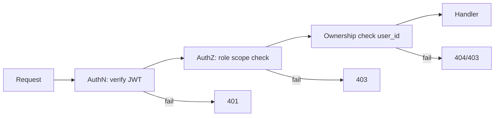

# 11 — Security

Defense-in-depth aligned to OWASP Top 10, ASVS, and privacy-by-design.

## 11.1 Authentication
- **Password hashing:** Argon2id (memory-hard) with per-user salt; never store plaintext. Enforce strength (≥10 chars, breached-password check via k-anonymity API).
- **Tokens:** short-lived JWT **access** (~15 min) + rotating **refresh** token (httpOnly, Secure, SameSite=strict cookie). Refresh rotation invalidates the prior token (detect reuse → revoke session family).
- **OAuth2:** Google/GitHub via authorization-code + PKCE; email verified before activation.
- **2FA:** optional TOTP; secrets stored encrypted; backup codes issued.
- **Session mgmt:** device/session list, revoke-single & logout-everywhere (`refresh_tokens` table).
- **Brute-force protection:** progressive backoff + rate limits + lockout + CAPTCHA after N failures.
- **Email verification & password reset:** single-use, time-limited, hashed tokens.

## 11.2 Authorization & RBAC
- **Roles:** `student` (default), `coach`, `admin`, `institution_admin` (`roles`/`user_roles`).
- **Enforcement:** every request passes authN then authZ middleware. Two checks:
  1. **Role/permission scope** (route-level, e.g., `/admin/*` requires admin).
  2. **Ownership** (row-level): resource `user_id` must equal caller (else `404` to avoid enumeration).
- **Defense-in-depth:** optional Postgres **Row-Level Security** keyed on `user_id`.
- **Principle of least privilege:** service DB users scoped; admin actions audited.

## 11.3 Encryption
- **In transit:** TLS 1.2+ everywhere (HSTS, secure ciphers); internal service traffic also TLS/mTLS post-extraction.
- **At rest:** AES-256 disk/volume encryption for DB and object storage; sensitive columns (TOTP secret, OAuth tokens) additionally app-layer encrypted (envelope encryption via KMS).
- **Secrets:** stored in a secrets manager/vault (never in code/repo); injected via env at runtime; rotated periodically.
- **Backups:** encrypted; access-controlled; restore tested.

## 11.4 Input validation & output safety
- **Validation:** Pydantic schemas validate/normalize every request (types, ranges, enums, lengths); reject unknown fields.
- **Injection:** parameterized queries via ORM (no string SQL); ORM-level identifiers only.
- **XSS:** React auto-escaping; sanitize rich-text (resume/notes) with an allowlist; CSP header.
- **CSRF:** SameSite cookies + CSRF token for cookie-authenticated state-changing routes.
- **File uploads:** type/size validation, virus scan, store in object storage (not web root), serve via presigned URLs; never execute.
- **Mass assignment:** explicit schema fields; server sets `user_id`, timestamps, computed fields.

## 11.5 Rate limiting & abuse control
- **Tiered token-bucket** limits per user + per IP at the gateway/Redis: strict on auth (login/reset), moderate on writes, **stricter on AI** endpoints (per-tier quotas). `429` + `Retry-After`.
- **Bot/abuse:** CAPTCHA on suspicious auth; anomaly detection on spikes; WAF at the edge.
- **Cost protection:** AI token budgets per user/day; caching.

## 11.6 Error handling
- **Uniform envelope** (doc 05) with a `request_id`; **never leak** stack traces, SQL, or internals to clients.
- **Server-side:** structured logging of full error + `request_id`; alerts on error-rate spikes (Sentry).
- **Fail safe:** deny by default; graceful degradation when dependencies (AI/third-party) fail.
- **No sensitive data in logs:** PII/secret redaction in logging pipeline.

## 11.7 Data privacy & compliance
- **PII minimization:** collect only what's needed; PII isolated in `profiles`.
- **User rights:** self-service **export** (`/me/export`) and **delete** (`/me/account`, soft-delete → purge job) for data portability/erasure.
- **Consent:** explicit opt-in for third-party sync (GitHub/LinkedIn) and AI processing.
- **Third-party data:** respect provider ToS (esp. LinkedIn — compliant read/manual only).
- **Auditability:** `audit_logs` for sensitive/admin actions (actor, action, entity, IP).
- **Data residency-ready:** region-scoped deployment possible; documented data-flow map.

## 11.8 Application & infra hardening
- **Headers:** HSTS, CSP, X-Content-Type-Options, X-Frame-Options/frame-ancestors, Referrer-Policy, Permissions-Policy.
- **Dependencies:** SCA scanning (Dependabot/Snyk), pinned versions, prefer packages published ≥7 days; SBOM.
- **Containers:** minimal base images, non-root user, read-only FS where possible, image scanning.
- **Network:** private subnets for DB/Redis; security groups; secrets not exposed; least-privilege IAM.
- **CI/CD security:** SAST + dependency + secret scanning gate merges; signed images; protected branches; no secrets in logs.
- **Monitoring:** intrusion/anomaly alerts; audit review; incident-response runbook.
- **Backups/DR:** automated encrypted backups, PITR, tested restores, documented RTO/RPO.

## 11.9 OWASP Top 10 coverage (summary)

| Risk | Control |
|------|---------|
| Broken Access Control | RBAC + ownership checks + RLS + audit |
| Cryptographic Failures | TLS, AES-256, KMS envelope, Argon2id |
| Injection | ORM parameterization, validation, sanitization |
| Insecure Design | Threat modeling, layered arch, least privilege |
| Security Misconfig | Hardened images, headers, IaC reviews |
| Vulnerable Components | SCA, pinning, patch cadence, SBOM |
| Auth Failures | Rotation, 2FA, lockout, session mgmt |
| Data Integrity Failures | Signed images, CI checks, FK constraints |
| Logging/Monitoring Failures | Structured logs, Sentry, alerts, audit trail |
| SSRF | Egress allowlist, validate outbound URLs (integrations) |
