# 13 — Deployment

Containerized, IaC-managed, GitHub Actions CI/CD. Runs locally via Docker Compose; production on Kubernetes or a managed container platform.

## 13.1 Deployment topology (production)

```mermaid
flowchart TB
  U[Users] --> CDN[CDN]
  U --> LB[Load Balancer / Ingress + WAF + TLS]
  CDN --> WEB[Web (Next.js) pods x N]
  LB --> WEB
  LB --> API[API (FastAPI) pods x N]
  API --> PG[(PostgreSQL primary)]
  PG --> PGR[(Read replica)]
  API --> REDIS[(Redis)]
  API --> OBJ[(Object Storage)]
  API -- enqueue --> REDIS
  WORK[Worker pods x N] --> REDIS
  WORK --> PG
  BEAT[Scheduler/Beat] --> REDIS
  AIGW[AI Gateway pods] --> LLM[LLM Provider]
  API --> AIGW
  subgraph Observability
    PROM[Prometheus] --> GRAF[Grafana]
    SENTRY[Sentry]
    LOGS[Log aggregation]
  end
  API -. metrics/logs .-> Observability
  WORK -. metrics/logs .-> Observability
```

- **Stateless** web/api/worker pods autoscale (HPA on CPU/RAM/queue depth).
- **Stateful** Postgres (HA primary + replica, PITR), Redis (managed/replicated), object storage (managed).
- **AI Gateway** deployable inline (v1) or as a separate service (extraction path).

## 13.2 Environments & promotion

| Env | Trigger | Data | Purpose |
|-----|---------|------|---------|
| local | dev | seed | Docker Compose full stack |
| preview | per-PR | ephemeral seed | Review app auto-deployed by CI, torn down on merge/close |
| staging | merge to `main` | anonymized/seed | Pre-prod; runs E2E, load, DAST |
| production | tagged release / manual approve | live | Live traffic |

Promotion: PR → preview → merge → staging (auto) → production (manual approval / release tag). Blue-green or rolling deploys with health-gated cutover; DB migrations run as a gated pre-deploy step (expand-migrate-contract for zero-downtime).

## 13.3 CI/CD pipeline (GitHub Actions)

```mermaid
flowchart LR
  PR[PR opened] --> L[Lint + Typecheck]
  L --> UT[Unit + Integration + API tests]
  UT --> SEC[SAST + deps + secret scan]
  SEC --> BUILD[Build images]
  BUILD --> PREV[Deploy Preview env]
  PREV --> E2E[E2E smoke on preview]
  E2E --> REV[Review + approve + merge]
  REV --> STG[Deploy Staging + migrate]
  STG --> FULL[Full E2E + load + DAST]
  FULL --> REL[Tag release]
  REL --> PROD[Deploy Prod + migrate + healthcheck]
  PROD --> MON[Monitor / rollback if SLO breach]
```



**Stages:** lint/typecheck → test (matrix) → security scans → build & scan images → push to registry → deploy (env) → migrate → smoke/health → promote. Rollback = redeploy previous image tag; migrations designed backward-compatible.

## 13.4 Docker

**Images:** `web` (Next.js), `api` (FastAPI), `worker` (Celery). Multi-stage builds, slim/distroless base, non-root user, pinned deps.

**docker-compose.yml (local) — services:**
```yaml
services:
  web:      # Next.js dev
  api:      # FastAPI (uvicorn --reload)
  worker:   # celery worker
  beat:     # celery beat scheduler
  postgres: # postgres:16 + pgvector
  redis:    # redis:7
  minio:    # S3-compatible object storage
  mailhog:  # local email capture
```

**Sample API Dockerfile (illustrative):**
```dockerfile
FROM python:3.12-slim AS base
ENV PYTHONUNBUFFERED=1 PIP_NO_CACHE_DIR=1
WORKDIR /app
FROM base AS deps
COPY pyproject.toml uv.lock ./
RUN pip install uv && uv sync --frozen --no-dev
FROM base AS runtime
RUN useradd -m app
COPY --from=deps /app/.venv /app/.venv
COPY app ./app
ENV PATH="/app/.venv/bin:$PATH"
USER app
EXPOSE 8000
HEALTHCHECK CMD curl -f http://localhost:8000/health || exit 1
CMD ["gunicorn","app.main:app","-k","uvicorn.workers.UvicornWorker","-b","0.0.0.0:8000","-w","4"]
```

## 13.5 Environment variables (contract)

| Variable | Service | Purpose |
|----------|---------|---------|
| `DATABASE_URL` | api, worker | Postgres DSN |
| `DATABASE_REPLICA_URL` | api | Read replica (optional) |
| `REDIS_URL` | api, worker, beat | Cache/broker |
| `JWT_SECRET` / `JWT_ACCESS_TTL` / `JWT_REFRESH_TTL` | api | Token signing/expiry |
| `ARGON2_*` | api | Hashing params |
| `OAUTH_GOOGLE_CLIENT_ID/SECRET` | api | Google OAuth |
| `OAUTH_GITHUB_CLIENT_ID/SECRET` | api | GitHub OAuth + sync |
| `LLM_PROVIDER` / `LLM_API_KEY` / `LLM_MODEL` | ai-gateway | AI provider |
| `EMBEDDINGS_MODEL` | ai-gateway | RAG embeddings |
| `OBJECT_STORAGE_ENDPOINT/KEY/SECRET/BUCKET` | api, worker | Files/exports |
| `EMAIL_PROVIDER_API_KEY` / `EMAIL_FROM` | worker | Transactional email |
| `SENTRY_DSN` | all | Error tracking |
| `OTEL_EXPORTER_OTLP_ENDPOINT` | all | Traces/metrics |
| `RATE_LIMIT_*` | api | Limits/quotas |
| `APP_ENV` / `LOG_LEVEL` / `FRONTEND_URL` | all | Runtime config |
| `NEXT_PUBLIC_API_URL` | web | API base URL |

Secrets injected from a secrets manager (never committed). `.env.example` documents all keys.

## 13.6 Cloud & infrastructure
- **Cloud-agnostic** via containers + Terraform. Reference target: AWS (EKS/ECS + RDS Postgres + ElastiCache Redis + S3 + CloudFront + ACM + Secrets Manager). Equivalents on GCP/Azure or managed PaaS (Render/Fly.io/Railway) for early stage.
- **IaC:** Terraform modules for network (VPC, subnets, SGs), data (RDS, Redis, S3), compute (cluster, node groups), edge (LB, CDN, WAF, TLS), secrets, and observability.
- **Networking:** public LB/CDN; private subnets for DB/Redis; least-privilege IAM/roles.
- **Autoscaling:** HPA on web/api/worker; DB vertical scale + read replicas; queue-depth-based worker scaling.

## 13.7 Observability & operations
- **Metrics:** Prometheus + Grafana (RED/USE dashboards, queue depth, DB, AI cost/latency).
- **Tracing:** OpenTelemetry end-to-end.
- **Errors:** Sentry (FE+BE) with `request_id` correlation.
- **Logs:** structured JSON → aggregation (Loki/ELK); PII redaction.
- **Alerting:** SLO-based alerts (latency, error rate, queue backlog, uptime) → on-call.
- **Health:** `/health` (liveness), `/ready` (readiness: DB/Redis).

## 13.8 Backups, DR, and SLOs
- **Backups:** automated encrypted DB backups + PITR; object-storage versioning; periodic restore drills.
- **DR:** documented RTO/RPO; multi-AZ; region failover plan (later).
- **SLOs:** 99.9% uptime; P95 API < 300ms read / < 600ms write; error rate < 0.5%.
- **Runbooks:** deploy, rollback, incident response, secret rotation, migration recovery.
