# 14 — Development Roadmap

12 delivery phases. Each phase has **objective, deliverables, entry criteria, exit criteria**. Phases build incrementally on a shippable core; foundations (auth, data, CI, observability) come first so every later module inherits them.

> Estimates are indicative (small team). Sequence matters more than exact durations.

## Phase 1 — Architecture & Foundations
- **Objective:** Stand up the skeleton: repo/monorepo, CI/CD, containers, DB, migrations, observability, design system shell.
- **Deliverables:** Monorepo (web/api/worker), Docker Compose, Postgres + Alembic baseline, GitHub Actions (lint/test/build/deploy preview), Sentry/OTel wiring, Tailwind + shadcn base, OpenAPI scaffold, `.env.example`, health/ready endpoints.
- **Entry:** Approved docs (this set).
- **Exit:** "Hello world" web+api deploy to preview via CI; migrations run; health checks green; design tokens + base layout render (light/dark).

## Phase 2 — Authentication & Accounts
- **Objective:** Secure identity & session foundation.
- **Deliverables:** Register/verify/login/refresh/logout, OAuth (Google/GitHub), password reset, optional TOTP, RBAC (roles), profile CRUD, session management, rate limiting on auth, audit logging.
- **Entry:** Phase 1 exit.
- **Exit:** Full auth flows pass unit/API/E2E; RBAC + ownership enforced; security scans clean; `/auth/me` works.

## Phase 3 — Dashboard & App Shell
- **Objective:** Navigable app shell + dashboard scaffolding + Career Readiness Index v0.
- **Deliverables:** Sidebar/top-bar nav, command palette, notifications shell, onboarding wizard (role/date/domains), dashboard with placeholder widgets, CRI engine v0 + `/me/career-readiness-index`, analytics_snapshots plumbing.
- **Entry:** Phase 2 exit.
- **Exit:** Onboarding → dashboard journey works; CRI computes a baseline; theming/responsive verified.

## Phase 4 — Learning Module
- **Objective:** LMS with progress + spaced revision.
- **Deliverables:** Domains/topics/sub-topics (admin-seeded taxonomy), tracked domains, topic_progress, notes, resources, revision scheduler + reminders, learning sub-score, learning dashboard.
- **Entry:** Phase 3 exit.
- **Exit:** Learning flow (doc 07.4) E2E; revision reminders fire; learning sub-score feeds CRI.

## Phase 5 — Coding Tracker
- **Objective:** Practice logging + consistency analytics.
- **Deliverables:** Coding problems CRUD, streaks, heatmap, coverage radar, revisit queue, coding sub-score, coding dashboard.
- **Entry:** Phase 4 exit.
- **Exit:** Coding flow E2E; heatmap/streak accurate; coding sub-score feeds CRI.

## Phase 6 — Projects (+ GitHub)
- **Objective:** Portfolio projects + GitHub integration.
- **Deliverables:** Projects/milestones/tasks Kanban, GitHub OAuth + repo/activity sync (async), repo↔project link, project & GitHub sub-scores, project dashboard.
- **Entry:** Phase 5 exit.
- **Exit:** Project flow E2E; GitHub sync populates repos/stats; sub-scores feed CRI.

## Phase 7 — Companies (CRM) + LinkedIn
- **Objective:** Target-company pipeline foundation + brand tracking.
- **Deliverables:** Companies + contacts CRUD, priorities, search; LinkedIn profile/completeness + networking log; company dashboard.
- **Entry:** Phase 6 exit.
- **Exit:** CRM flow E2E; company dashboard renders; LinkedIn sub-score feeds CRI.

## Phase 8 — Applications
- **Objective:** Funnel tracking + deadlines.
- **Deliverables:** Applications CRUD, funnel Kanban, status transitions (with rules), deadlines + reminders, resume-version linkage, follow-up tasks, placement/offer-funnel dashboards, application sub-score.
- **Entry:** Phase 7 exit.
- **Exit:** Company→application→funnel journey E2E; deadline reminders fire; funnel analytics correct.

## Phase 9 — Interviews (+ Resume/ATS)
- **Objective:** Interview tracking + resume studio with ATS.
- **Deliverables:** Interviews (rounds/questions/feedback/outcomes), upcoming calendar, interview dashboard + sub-score; Resume Studio (versions/sections/editor/preview), deterministic ATS scan + keyword gap, PDF export.
- **Entry:** Phase 8 exit.
- **Exit:** Interview + resume flows E2E; ATS scoring works; sub-scores feed CRI.

## Phase 10 — Analytics & Score v1
- **Objective:** Complete analytics suite + robust Career Readiness Index.
- **Deliverables:** All 8 dashboards polished, CRI engine v1 (role-weighted pillars, trend history, biggest-lever insight), auto-insights + insight notifications, goals & achievements (gamification), rollup jobs + partitioning prep.
- **Entry:** Phase 9 exit.
- **Exit:** Dashboards performant (<2s), CRI trend + breakdown accurate & explainable; achievements/goals work.

## Phase 11 — AI Layer
- **Objective:** Intelligence tier.
- **Deliverables:** AI Gateway (prompts/cache/guardrails/cost), RAG (pgvector) over user data, Career Coach, Resume Review, Mock Interview, recommendations (learning/revision/project/company), weak-area detection, sprint auto-plan, interview prediction (rule/LLM v1), AI usage logging + tiered gating, AI evals in CI.
- **Entry:** Phase 10 exit.
- **Exit:** AI features return grounded, schema-valid outputs; guardrail/eval suite passes; cost controls verified; graceful fallback on provider outage.

## Phase 12 — Hardening & Deployment (GA)
- **Objective:** Production readiness & launch.
- **Deliverables:** Load/perf tuning, DAST + pen-test fixes, accessibility audit (AA), full E2E matrix, backups/PITR + restore drill, DR runbooks, autoscaling + HA, staging→prod promotion with blue-green + gated migrations, monitoring/alerting/SLOs, docs/onboarding polish, billing/subscription gating stub.
- **Entry:** Phase 11 exit.
- **Exit:** Meets SLOs under load; security/a11y clean; DR validated; GA release tagged and deployed.

---

## Cross-phase workstreams (continuous)
- **Quality gates** (doc 12) enforced from Phase 1.
- **Security** (doc 11) reviewed each phase; scans in CI.
- **Observability** dashboards/alerts extended as modules land.
- **Docs & OpenAPI** kept in sync with each API addition (FE types generated from spec).
- **Design system** components added as needed, reused across modules.

## Dependency graph (phase ordering)

```mermaid
flowchart LR
  P1[1 Foundations] --> P2[2 Auth]
  P2 --> P3[3 Dashboard/Shell]
  P3 --> P4[4 Learning]
  P4 --> P5[5 Coding]
  P5 --> P6[6 Projects+GitHub]
  P6 --> P7[7 Companies+LinkedIn]
  P7 --> P8[8 Applications]
  P8 --> P9[9 Interviews+Resume]
  P9 --> P10[10 Analytics+Score v1]
  P10 --> P11[11 AI]
  P11 --> P12[12 Hardening/GA]
```

## Post-GA (beyond this roadmap)
- Institutional/B2B2C: cohort dashboards, admin, SSO, bulk seats (product v1.x).
- Native mobile apps (API-first foundation already supports it).
- ML-based interview prediction trained on accumulated prep→outcome data.
- Marketplace/community, job-board integrations (product v2.0).
