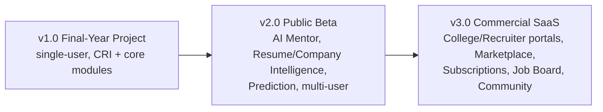

# 15 — CTO Review: Improvement Roadmap (CareerOS v2 Vision)

> This document formalizes the CTO-level review that evolves the product from a
> **Placement Management System** (tracker) into **CareerOS — an AI-Powered Career
> Intelligence Platform**. It supersedes framing in earlier docs where noted and
> defines the engines, data-model additions, and versioned evolution that get us there.

---

## 15.0 Vision & philosophy change

**Rebrand:** `Placement Management System` → **`CareerOS — AI-Powered Career Intelligence Platform`** (a.k.a. *Career Intelligence Platform*).

**Why:** more professional, startup-grade branding; broader than placements; scalable SaaS; stronger resume/portfolio value.

**Core philosophy shift** — from *track placements* to a closed-loop **career intelligence engine**:

```
Predict Career Growth
      ↓
Track Progress
      ↓
Recommend Improvements
      ↓
Build Skills
      ↓
Prepare Interviews
      ↓
Secure Offers   ──┐
      ↑            │ (feedback loop: outcomes retrain prediction)
      └────────────┘
```

CareerOS is a **Career Intelligence Platform**, not a placement tracker. Every action becomes data; every dataset drives prediction and recommendation.

---

## 15.1 Career Readiness Index (CRI) — replaces Employability Score

The single North-Star metric is renamed and expanded to the **Career Readiness Index (CRI)**, a 0–100% composite.

**CRI pillars (weighted, role-tuned):**
Learning · Coding · DSA · Projects · Resume Quality · GitHub Activity · LinkedIn Activity · Applications · Interview Performance · Communication · Consistency · Certifications (optional).

**Dashboard presentation:**
```
Career Readiness Index  ── 87%

Learning        90%   ██████████
Coding          84%   █████████
DSA             79%   ████████
Projects        82%   █████████
Resume          95%   ██████████
GitHub          78%   ████████
LinkedIn        70%   ███████
Applications    65%   ███████
Interview       60%   ██████
Communication   72%   ███████
Consistency     88%   █████████
Certifications  40%   ████        (optional)
```

**Formula (v2):** `CRI = Σ (pillar_score × role_weight(pillar) × pillar_weight)`, normalized 0–100, where `role_weight` comes from the target role profile and `Consistency` is derived from streaks/activity cadence. Stored as a time series (`readiness_scores`) for trend + prediction inputs.

**Migration note:** the data model's `employability_scores` table/endpoints are renamed to `readiness_scores` / `/me/career-readiness-index`; the `breakdown` JSONB now carries the 12 pillars above.

---

## 15.2 Skill Intelligence Engine (upgrade of Learning)

Elevates skill tracking from status flags to a multi-dimensional **Skill Intelligence Engine**. Each skill carries:

| Dimension | Meaning |
|-----------|---------|
| Learning Status | not started → mastered |
| Interview Importance | ★ rating (role-weighted) |
| Market Demand | ★ rating (curated + trend data) |
| Confidence Level | self + inferred (0–100%) |
| Practice Score | from coding/exercises |
| Resume Coverage | is it evidenced on the resume? |
| Project Coverage | # projects using it |
| Interview Performance | from logged interview questions |
| Revision Due | spaced-repetition flag |
| AI Recommendation | next best action |

**Example**
```
Python   ·  Interview ★★★★★  ·  Demand ★★★★★
Confidence 84%  ·  Projects 4  ·  Resume ✓  ·  Needs Revision ✓
AI: "Revise decorators + generators; add 1 async project for DE roles."
```

**Data model additions:** `skills` (canonical catalog with `interview_importance`, `market_demand`), `user_skills` (per-user computed dimensions), links from `topics`, `coding_problems`, `projects`, `resume_sections`, `interview_questions` → `skills`.

---

## 15.3 Career Heatmap

A visual strength/weakness heatmap across skills for instant gap identification.

```
Python      █████████
SQL         ████████
Pandas      ███████
Power BI    █████
Statistics  ████
Airflow     ██
Spark       █
Cloud       █
```

**Purpose:** spot weak areas instantly → prioritize learning → feed AI recommendations. **Source:** `user_skills` composite (confidence × coverage × practice). Rendered as a color-graded bar/heatmap component; drives the "weakest skill" dashboard answer.

---

## 15.4 Company Matching Engine

Companies become **recommendations**, not just records. Each company card shows:

- **Company Match %** (skills/projects/resume vs. company profile)
- **Current Readiness**
- **Skills Missing** · **Projects Missing** · **Resume Match**
- **Interview Probability** · **Expected Timeline (weeks to ready)**

**Example**
```
Tiger Analytics   ── Match 91%
Missing: Statistics
Expected Readiness: 3 weeks
```

**Engine:** compares `user_skills`/CRI against a `company_profiles` requirement vector (role, skills, difficulty). Outputs match score + gap list + a readiness-ETA (gap ÷ recent learning velocity). Data model: `company_profiles`, `company_match_snapshots`.

---

## 15.5 Resume Intelligence (upgrade of Resume)

Resume Management → **Resume Intelligence**:
- ATS Score · Missing Keywords · Missing Skills · Missing Projects
- Role-specific and Company-specific resume suggestions
- Resume Versions · Resume History · **Resume Analytics** (score trend, keyword coverage over time)

**Data model additions:** `resume_analytics` (per-version score history), keyword/skill gap stored as JSONB; ties into Skill Intelligence (Resume Coverage dimension) and Company Matching (Resume Match).

---

## 15.6 AI Career Mentor (upgrade of AI Coach)

From chatbot → **proactive AI Mentor** with a daily briefing.

```
Good morning, Bharat

Yesterday   ✓ Python   ✓ SQL   ✗ DSA

Today's Plan
  • Complete Functions
  • Solve 5 SQL queries
  • Finish 3 DSA problems
  • Continue Student Project

Expected Completion: 84%
```

**Capabilities:** daily planning, weekly review, motivation, interview prep, learning recommendations, weak-area detection. Grounded on CRI + Skill Intelligence + funnel; proposes action cards the user accepts (creates tasks/sprints/revisions).

---

## 15.7 Placement Prediction Engine

Predicts, per target/application:
- Interview Probability · OA Probability · Offer Probability · Placement Readiness + Confidence band.

**Example**
```
Current Readiness 86%
Interview Probability 74%
Offer Probability 61%
Confidence: Medium
```

**Approach:** rules + LLM heuristics at launch → ML model trained on the accumulating **prep-behavior → outcome** dataset. Inputs: CRI + pillars, company match, historical interview performance, funnel history. Stored: `prediction_snapshots`.

---

## 15.8 Placement Analytics Dashboard (Application Funnel)

```
Companies Saved  120
       ↓
Applied           85
       ↓
OA                42
       ↓
Interview         18
       ↓
Offer              5
       ↓
Accepted           2
```

**Charts:** Monthly Applications · OA Success Rate · Interview Success Rate · Offer Rate · Rejection Analysis. Extends doc 09's placement/offer funnel with stage conversion %, leakage callouts, and rejection-reason breakdown.

---

## 15.9 Interview Intelligence

Every interview becomes structured data:
- Questions asked, categorized: Python / SQL / DSA / HR / Project questions
- Mistakes · Confidence · Lessons Learned

AI later detects patterns (e.g., "weak on SQL window questions across 3 interviews") and feeds Skill Intelligence + weak-area detection. Data model: extend `interview_questions` with `skill_id`, `mistake`, `lesson`; add `interview_insights` rollup.

---

## 15.10 Smart Weekly Review (auto-generated)

Weekly review is generated, not manual:
```
This Week
  Python 92%  ·  SQL 85%  ·  DSA 61%  ·  Projects 72%
  Applications 10  ·  Interview Readiness 78%

Suggestions
  • Increase DSA
  • Revise SQL joins
  • Complete Dashboard project
```

Source: weekly snapshot diff + AI summarization; produces next-sprint plan automatically.

---

## 15.11 Smart Goal Engine

Goals are measurable and decomposed toward the target role:
```
Become Data Engineer
  Python 100% · SQL 100% · Power BI 100%
  Projects 6 · Resume Ready · Applications 100
  Interview Ready → Offer
```

Each goal links to concrete metrics/entities and rolls its progress into CRI + roadmap. Data model: extend `goals` with `parent_goal_id`, `metric`, `target_value`.

---

## 15.12 Learning Recommendation Engine

AI recommends: Next Topic · Revision · Weak Areas · Practice Questions · New Projects · Sprint Planning. Consumes Skill Intelligence + Career Heatmap + deadlines/velocity. (Extends doc 10 §10.5–10.6.)

---

## 15.13 Project Intelligence (upgrade of Projects)

Projects are **evaluated**, not just stored. Each project scored on:
Resume Value · Skill Coverage · Company Relevance · Difficulty · GitHub Quality · Documentation Score · Interview Readiness.

Feeds Resume Intelligence (Missing Projects), Company Matching (Projects Missing), and CRI (Projects pillar). Data model: `project_evaluations`.

---

## 15.14 GitHub Intelligence

Track: Commits · Streak · Languages · README Quality · Documentation · Activity · **Repository Health** (composite). Feeds GitHub pillar + Project Intelligence (GitHub Quality). Extends `github_repositories` with health/README-quality fields.

---

## 15.15 LinkedIn Intelligence

Track: Profile Completion · Connections · Recruiters · Posts · Skills · Engagement · Recommendations. Feeds LinkedIn pillar + Personal Career CRM (recruiters). Extends `linkedin_profiles`.

---

## 15.16 Career Dashboard — questions it must answer

The dashboard is designed to answer, at a glance:
- Where am I? · What should I do today? · What is pending? · What should I revise?
- Which companies should I apply to? · What is my readiness (CRI)? · What is my weakest skill? · How close am I to an offer?

Each maps to a widget: CRI ring, AI Mentor plan, pending tasks, revision-due, Company Matching top-picks, Career Heatmap weakest bar, Placement Prediction gauge.

---

## 15.17 Gamification

Achievements: Python Beginner · SQL Master · 100 Problems Solved · 10 Projects Completed · 30-Day Streak · Resume Ready · Interview Ready · Offer Achieved. Streaks feed the **Consistency** CRI pillar.

---

## 15.18 AI Roadmap Generator

Generates a personalized roadmap from: Target Role · Graduation Date · Skill Level · Time Available · Company Targets.
```
Target: Data Engineer  ·  Time Remaining: 20 weeks
Today: Python · SQL · Projects
Expected Readiness: Week 18
```
Produces milestone timeline + weekly sprints; recalculates ETA as velocity changes.

---

## 15.19 Personal Career CRM

Track relationships: Recruiters · Alumni · Mentors · HR Contacts · Referrals · Networking History · Follow-ups. Extends Company CRM with a people graph. Data model: `contacts` (typed), `interactions` (follow-up log with reminders).

---

## 15.20 Notifications Engine

Notify on: Revision Due · Sprint Due · Resume Update · GitHub Inactive · LinkedIn Inactive · Company Deadline · OA Date · Interview Date. Preference-aware, multi-channel (extends doc 08.14 / doc 07.12).

---

## 15.21 Analytics Engine

Weekly & Monthly Reports · Productivity Charts · Coding Heatmaps · Skill Growth · Resume Growth · GitHub Activity · Placement Funnel · Interview Funnel. (Extends doc 09 with skill-growth and report generation.)

---

## 15.22 Future AI Feature Architecture

Design (behind the AI Gateway, doc 10) for:
AI Resume Reviewer · AI Mock Interviewer · AI Career Coach/Mentor · AI Learning Planner · AI Sprint Generator · AI Project Reviewer · AI Company Matcher · **AI Salary Estimator** · AI Interview Predictor.

Each is a gateway-mediated capability with prompt templates, RAG over user data, structured outputs, guardrails, caching, and cost controls.

---

## 15.23 New engines → architecture mapping

| New engine (this doc) | Lives in layer (doc 02) | New/changed data |
|-----------------------|-------------------------|------------------|
| CRI | Business (scoring) + Analytics | `readiness_scores` (was `employability_scores`), 12 pillars |
| Skill Intelligence | Business + AI | `skills`, `user_skills` |
| Career Heatmap | Analytics/Presentation | derived from `user_skills` |
| Company Matching | AI + Business | `company_profiles`, `company_match_snapshots` |
| Resume Intelligence | Business + AI | `resume_analytics` |
| AI Mentor | AI Gateway | `ai_interactions` (existing) |
| Placement Prediction | AI + ML service | `prediction_snapshots` |
| Project Intelligence | Business + AI | `project_evaluations` |
| Career CRM | Business | `contacts`, `interactions` |

These extend — not replace — the modular-monolith + microservices-ready architecture; AI/Analytics/Prediction remain extraction candidates.

---

## 15.24 Product Evolution Roadmap

### v1.0 — Final-Year Project (single-user)
Focus: your own placement journey.
Dashboard · Learning · Coding · Projects · Resume · GitHub · Applications · Interviews · Analytics · **CRI**.

### v2.0 — Public Beta (multi-user platform)
Open to students. Add: AI Mentor · Resume Intelligence · Company Matching · Career Prediction · Multi-user support · Shared roadmaps.

### v3.0 — Commercial SaaS (startup product)
Expand: College Admin Dashboard · Recruiter Portal · Mentor Marketplace · Referral System · Subscription Plans · Community Features · Job Board Integration · Advanced AI Career Analytics.



---

## 15.25 Impact on earlier docs (change log)

| Earlier doc | Change |
|-------------|--------|
| 00 Index / 01 Product | Rebrand to CareerOS – Career Intelligence Platform; philosophy shift; CRI |
| 03/04 Database | `employability_scores`→`readiness_scores` (12 pillars); add `skills`, `user_skills`, `company_profiles`, `project_evaluations`, `resume_analytics`, `prediction_snapshots`, `contacts`, `interactions` |
| 05 API | `/me/employability-score*` → `/me/career-readiness-index*`; add skill/company-match/prediction endpoints |
| 08 Module design | Learning→Skill Intelligence; Projects→Project Intelligence; Resume→Resume Intelligence; AI Coach→AI Mentor |
| 09 Analytics | Add Career Heatmap, Skill Growth, auto Weekly Review, report generation |
| 10 AI features | Add Company Matcher, Salary Estimator, Placement Prediction, Project Reviewer; Coach→Mentor |
| 14 Roadmap | Aligns engineering phases to v1/v2/v3 product evolution above |

> The detailed DDL/endpoint changes are additive; treat this doc as the authoritative v2 direction. Implementation sequencing follows doc 14 phases, delivering v1.0 first.
