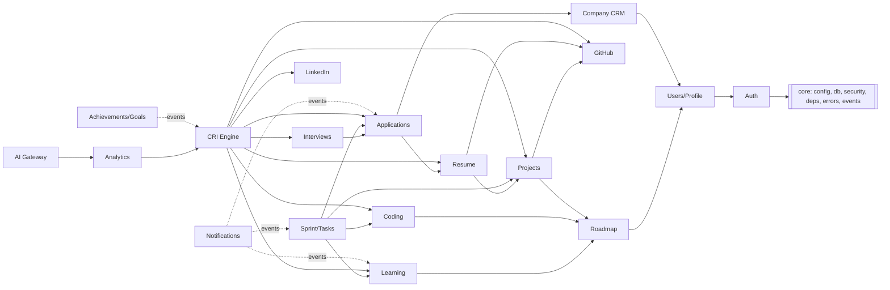

# 16 — Engineering Implementation Plan

> **Status:** Awaiting approval before production code is written.
> **Role:** Lead Software Engineer, CareerOS.
> **Basis:** This plan is derived from docs 01–15 and does not change any approved
> decision; it operationalizes *how* we build them incrementally, test-first, and
> production-ready. Nothing here is code — it is the engineering playbook.

## 0. Documentation review — what this plan honors

| Source doc | Key constraints carried into implementation |
|-----------|----------------------------------------------|
| 01 Product | North-Star = job before graduation; CRI is the heartbeat; 4 personas; 23 FRs / 12 NFR categories |
| 02 Architecture | Modular monolith, dependency-inward layering, API-first, async-by-default, event-oriented, stateless, microservices-ready seams (AI/Analytics/Notifications/Integrations) |
| 03/04 Database | UUID PKs, `TIMESTAMPTZ` UTC, tenant-scoped by `user_id`, 3NF, composite indexes leading with `user_id`, enums/constraints/triggers, `readiness_scores`, funnel view |
| 05 API | `/api/v1`, standard error envelope, per-module endpoint catalog, validation & error codes |
| 06/07 UI/Journeys | App shell + nav, command palette, CRI pill, dark/light, WCAG 2.1 AA, 12 module journeys |
| 08 Modules | 13 modules + CRI engine; each has purpose/features/I-O/KPIs/tables/APIs/UI |
| 09 Analytics | 8 dashboards, chart specs, funnels, biggest-lever insight |
| 10 AI | AI Gateway is the only path to the LLM; RAG via pgvector; guardrails; "AI proposes, user confirms" |
| 11 Security | Argon2id, JWT + rotating refresh, OAuth2+PKCE, TOTP, RBAC + ownership, rate limiting, audit |
| 12 Testing | Test pyramid + contract/E2E/a11y/security/perf; quality gates from Phase 1 |
| 13 Deployment | Docker Compose local; CI/CD; env-var contract; preview/staging/prod |
| 14 Roadmap | 12 phases, strict ordering, entry/exit criteria |
| 15 Improvement | CareerOS rebrand; CRI (12 pillars); intelligence engines; v1/v2/v3 evolution |

**Non-negotiables (from the user's rules):** never generate the whole project at once; ship one fully-functional milestone at a time; clean architecture; reusable modules; documented components; meaningful commits; never skip testing.

---

## 1. Engineering Implementation Plan

### 1.1 Strategy
- **Vertical slices, not horizontal layers.** Each milestone delivers a thin, *fully working* slice (DB → repo → service → API → UI → tests) so the app is always demoable and deployable.
- **Foundations before features.** Phase 1 stands up the "walking skeleton" (repo, CI, containers, DB, migrations, observability, design system, health checks) so every later module inherits quality gates, auth, and infra for free.
- **Contract-first per module.** For each module we (1) freeze the OpenAPI slice from doc 05, (2) generate FE types, (3) implement backend to the contract, (4) build UI against generated types. This prevents FE/BE drift.
- **Test-first at the gate that matters.** Unit tests for domain rules (CRI math, funnel transitions, revision scheduling) written alongside the service; API/contract tests per endpoint; E2E for each module's golden journey (doc 07) before the milestone is "done."
- **Event-driven side effects from day one.** Score recompute, analytics snapshots, achievements, and notifications are driven by domain events, so modules stay decoupled and extraction-ready.

### 1.2 Definition of Done (per milestone)
A milestone is complete only when **all** hold:
1. Backend: models + migration + repo + service + router; unit + API tests green; OpenAPI updated.
2. Frontend: pages/components wired to generated types; loading/error/empty states; light/dark; responsive; a11y pass (axe) on new screens.
3. The module's golden E2E journey (doc 07) passes in CI.
4. Lint + typecheck + format clean (ruff/mypy, eslint/tsc/prettier).
5. Coverage does not regress; new domain logic ≥ 85% line coverage.
6. Docs updated: module README + any API/DB deltas; ADR if a decision was made.
7. CI green (incl. security/dependency scan); preview deploy healthy.
8. Demo of the golden journey recorded/verified; PR reviewed and merged.

### 1.3 Milestone breakdown (maps 1:1 to doc 14 phases)
Each phase below is itself split into **incremental PRs** (never one mega-PR):

- **M1 Foundations** → PRs: (a) monorepo + tooling, (b) FastAPI skeleton + health/ready + error envelope, (c) Next.js shell + design tokens + light/dark, (d) Postgres + Alembic baseline + `readiness_scores`-ready base, (e) Docker Compose, (f) CI pipeline + Sentry/OTel wiring.
- **M2 Auth & Accounts** → PRs: password auth (register/login/refresh/logout) → RBAC + ownership guards → profile CRUD → OAuth (Google/GitHub) → optional TOTP → auth rate-limit + audit log.
- **M3 Dashboard & Shell** → PRs: nav shell + command palette → onboarding wizard (role/date/domains) → dashboard widgets (placeholders) → **CRI engine v0** + `/me/career-readiness-index` → analytics_snapshots plumbing.
- **M4 Learning** → taxonomy seed → topic progress → notes/resources → revision scheduler + reminders → learning sub-score → learning dashboard.
- **M5 Coding** → problems CRUD → streak/heatmap → coverage radar + revisit queue → coding sub-score → coding dashboard.
- **M6 Projects + GitHub** → projects/milestones/tasks Kanban → GitHub OAuth + async sync → repo↔project link → project/github sub-scores → project dashboard.
- **M7 Companies + LinkedIn** → companies/contacts CRUD + search → LinkedIn profile/completeness + networking log → company dashboard.
- **M8 Applications** → applications CRUD + funnel Kanban → status transition rules → deadlines/reminders + resume linkage → funnel dashboards + application sub-score.
- **M9 Interviews + Resume/ATS** → interviews (rounds/questions/feedback) → interview dashboard + sub-score → Resume Studio (versions/sections) → deterministic ATS + keyword gap → PDF export.
- **M10 Analytics + CRI v1** → polish 8 dashboards → CRI v1 (role-weighted 12 pillars, trend, biggest-lever) → auto-insights + notifications → goals & achievements (gamification) → rollup jobs.
- **M11 AI Layer** → AI Gateway (prompts/cache/guardrails/cost) → RAG (pgvector) → Career Mentor → Resume Review → Mock Interview → recommendations + weak-area + sprint auto-plan → interview prediction (rule/LLM v1) → AI evals in CI.
- **M12 Hardening & GA** → perf/load, DAST + a11y audit, backups/PITR + DR drill, autoscaling/HA, blue-green + gated migrations, SLO monitoring, GA tag.

> **v2 engines from doc 15** (Skill Intelligence, Company Matching, Prediction, Resume/Project Intelligence, AI Mentor) are sequenced into M10–M11 and the post-GA v2 track; v1.0 ships M1–M12 for the single-user placement journey.

---

## 2. Development Order (build sequence)

Strict, because each step depends on the previous:

```
1  Repo + tooling + CI skeleton
2  Backend app factory + config + error envelope + health/ready
3  DB base + Alembic + first migration (core tables)
4  Frontend shell + design tokens + API client (typed)
5  Auth (identity) ─┐  ← everything user-scoped depends on this
6  Users/Profile    │
7  Roadmap/Target roles
8  Dashboard shell + CRI engine v0  ← needs auth + at least stubs
9  Learning → 10 Coding → 11 Projects/GitHub → 12 Companies/LinkedIn
13 Applications → 14 Interviews/Resume
15 Analytics + CRI v1  ← needs all activity modules feeding sub-scores
16 AI Layer            ← needs analytics + activity as RAG/context
17 Hardening + GA
```

Rationale: **auth is the taproot**; the **CRI engine is introduced early (v0) but finalized late (v1)** because it consumes every activity module; **AI is last** because it needs real user data + analytics to be useful and safe.

---

## 3. Dependency Graph (phases)

```mermaid
flowchart LR
  M1[M1 Foundations] --> M2[M2 Auth]
  M2 --> M3[M3 Dashboard + CRI v0]
  M3 --> M4[M4 Learning]
  M4 --> M5[M5 Coding]
  M5 --> M6[M6 Projects + GitHub]
  M6 --> M7[M7 Companies + LinkedIn]
  M7 --> M8[M8 Applications]
  M8 --> M9[M9 Interviews + Resume/ATS]
  M9 --> M10[M10 Analytics + CRI v1]
  M10 --> M11[M11 AI Layer]
  M11 --> M12[M12 Hardening + GA]

  %% cross-cutting introduced in M1, extended every phase
  X[[Cross-cutting: CI/CD, Security, Observability, Design System, OpenAPI/Types]]
  X -.enforced from M1.-> M1
```



---

## 4. Module Dependencies (code-level)

Directed edges = "depends on / reads from" (matches doc 02 §2.4):



**Rules enforced in code:**
- No module imports another module's `repo.py`/`models.py` directly — cross-module reads go through the owning module's `service.py` (or a subscribed domain event). Keeps seams clean for extraction.
- `core/` and `packages/contracts` may be imported by anyone; they import nobody upstream.
- The **CRI engine** subscribes to activity events; it does not couple modules to itself.
- **AI** depends on analytics/activity *read models*, never the reverse.

---

## 5. GitHub Repository Structure

Single monorepo `careeros` (Turborepo for JS + uv for Python), matching doc 02 §2.8:

```
careeros/
├─ docs/                      # this documentation set (01–16)
├─ apps/
│  ├─ web/                    # Next.js 14 (App Router, TS)
│  └─ api/                    # FastAPI (Python 3.12)
├─ packages/
│  ├─ contracts/              # OpenAPI spec + generated TS types
│  ├─ ui-tokens/              # design tokens (light/dark)
│  └─ config/                 # shared eslint/tsconfig/ruff/mypy
├─ infra/
│  ├─ docker/                 # Dockerfiles (web, api, worker)
│  ├─ compose/                # docker-compose.*.yml
│  └─ terraform/              # cloud IaC (later phases)
├─ .github/
│  ├─ workflows/              # ci.yml, deploy-preview.yml, security.yml
│  ├─ ISSUE_TEMPLATE/ , PULL_REQUEST_TEMPLATE.md
│  └─ CODEOWNERS
├─ .env.example
├─ docker-compose.yml
├─ turbo.json , package.json  # JS workspace
├─ CONTRIBUTING.md , CODING_STANDARDS.md , ARCHITECTURE.md
└─ README.md
```

Repo hygiene: branch protection on `main` (required CI + 1 review + up-to-date), signed commits optional, `CODEOWNERS` per app/package, Dependabot + secret scanning enabled, no secrets in repo (`.env` git-ignored).

---

## 6. Branching Strategy

**Trunk-based with short-lived feature branches** (best fit for continuous, milestone delivery):

- `main` — always releasable; protected; every merge is deployable to preview/staging.
- `feat/<milestone>-<slug>` — e.g. `feat/m2-auth-login`, one focused slice.
- `fix/<slug>`, `chore/<slug>`, `docs/<slug>`, `refactor/<slug>`.
- `release/vX.Y` — cut at GA and each product version (v1.0/v2.0/v3.0); tagged `vX.Y.Z` (SemVer).
- `hotfix/<slug>` — off a release tag, cherry-picked back to `main`.

Rules: branches short-lived (< ~2 days), rebased on `main` before merge, **squash-merge** to keep `main` linear and each feature one meaningful commit. Delete branch after merge. No direct pushes to `main`.

```
main ──●──────●──────●──────●─────►
        \    /  \    /  \   /
   feat/m2-login  feat/m2-rbac  feat/m2-oauth   (squash-merged)
```

---

## 7. Git Commit Strategy

**Conventional Commits**, enforced by commitlint + Husky (JS) / pre-commit (Python):

```
<type>(<scope>): <imperative summary>   # ≤ 72 chars

[body: what & why, not how]
[footer: Refs #issue, BREAKING CHANGE: ...]
```

- **types:** `feat, fix, docs, style, refactor, perf, test, build, ci, chore, revert`.
- **scopes:** module/app names — `auth, learning, coding, scoring, web, api, ci, db`.
- Examples:
  - `feat(auth): add rotating refresh-token endpoint`
  - `test(scoring): cover role-weighted CRI pillar math`
  - `fix(applications): reject illegal funnel transitions`
  - `chore(ci): add ruff + mypy gate`
- **Atomic commits:** one logical change each; migrations committed with the code that needs them; tests committed with the feature. No "wip"/"fix stuff" messages. Commit body explains rationale; the PR description carries the high-level summary. Squash-merge produces one clean commit per feature on `main`.

---

## 8. Coding Standards

**General:** clean architecture (deps point inward), small pure functions, explicit types, no dead code, no commented-out code, meaningful names, no magic numbers. Every public module/function documented (docstring / TSDoc). Feature-flag risky work.

**Backend (Python 3.12):**
- Style/lint: **ruff** (lint + format), **mypy** strict (`disallow_untyped_defs`); no `Any`, no `getattr/setattr` hacks.
- FastAPI: routers thin → delegate to `service.py`; validation via Pydantic v2 schemas; SQLAlchemy 2.0 typed models; data access only in `repo.py`.
- Errors via the standard envelope (doc 05); never leak internals. All timestamps UTC `TIMESTAMPTZ`. All queries tenant-scoped by `user_id`.
- Imports at top; no nested imports. Config via `pydantic-settings`; no hard-coded secrets.

**Frontend (TypeScript/Next.js):**
- **eslint** (typescript-eslint, jsx-a11y) + **prettier**; `strict: true` tsconfig; no `any`.
- Server components for data-heavy pages; TanStack Query for server state; Zustand for light UI state; API access only through the generated typed client.
- Components small and reusable; design-system primitives from `packages/ui-tokens` + shadcn/ui; every interactive element accessible (labels, roles, focus, keyboard).

**Testing standard:** pytest (unit/integration/API) + Vitest/RTL (component) + Playwright (E2E) + axe (a11y) + Schemathesis (contract). New domain logic ≥ 85% coverage; no PR merges red.

**Docs standard:** each module has a short README (purpose, endpoints, events, decisions); architectural decisions recorded as ADRs in `docs/adr/`.

---

## 9. Folder Structure (backend module convention)

Per doc 02 §2.8 — each `apps/api/app/modules/<name>/` is self-contained and extraction-ready:

```
modules/<name>/
├─ __init__.py
├─ models.py      # SQLAlchemy ORM (tables owned by this module)
├─ schemas.py     # Pydantic request/response DTOs
├─ repo.py        # data access (only place that touches the session for this module)
├─ service.py     # business rules + orchestration; emits domain events
├─ router.py      # FastAPI HTTP layer; delegates to service
├─ events.py      # events emitted/handled by this module
└─ tests/         # unit + api tests for this module
```

Shared backbone:
```
app/
├─ main.py                 # app factory + middleware
├─ core/                   # config, db, security, deps, errors, logging
├─ api/v1.py               # router aggregation under /api/v1
├─ events/                 # event bus + dispatch
├─ workers/                # celery app, tasks, beat
└─ modules/                # all domain modules (above convention)
```

Frontend mirrors this with `features/<name>/` (hooks, api client, views) + `components/` (design system, charts, forms, layout).

---

## 10. Development Timeline (indicative, small team)

Sequence is fixed; durations are estimates and can compress with parallel FE/BE work within a milestone.

| Milestone | Scope | Est. | Gate to advance |
|-----------|-------|------|-----------------|
| M1 | Foundations / walking skeleton | Week 1–2 | Preview deploy green; migrations run; shell renders |
| M2 | Auth & Accounts | Week 3–4 | Auth E2E + RBAC + security scan clean |
| M3 | Dashboard + CRI v0 | Week 5 | Onboarding→dashboard journey; CRI baseline |
| M4 | Learning | Week 6–7 | Learning E2E; revision reminders; sub-score feeds CRI |
| M5 | Coding | Week 8 | Coding E2E; heatmap/streak accurate |
| M6 | Projects + GitHub | Week 9–10 | Project E2E; GitHub sync populates repos |
| M7 | Companies + LinkedIn | Week 11 | CRM E2E; company dashboard |
| M8 | Applications | Week 12 | Funnel journey E2E; deadline reminders |
| M9 | Interviews + Resume/ATS | Week 13–14 | Interview + resume E2E; ATS + PDF export |
| M10 | Analytics + CRI v1 | Week 15–16 | Dashboards <2s; CRI explainable; gamification |
| M11 | AI Layer | Week 17–18 | Grounded AI; guardrail/eval suite passes; fallback |
| M12 | Hardening + GA | Week 19–20 | SLOs under load; security/a11y clean; DR validated; GA tag |

**Continuous across all milestones:** quality gates, security review + scans, observability dashboards, OpenAPI/type sync, design-system growth (doc 14 cross-phase workstreams).

Post-GA (v2 track, doc 15): Skill Intelligence, Company Matching, Placement Prediction, Resume/Project Intelligence, AI Mentor, multi-user; then v3 SaaS (college/recruiter portals, marketplace, billing).

---

## Approval gate

Per your instruction, **no production code will be written until you approve this plan.** On approval, I will begin **M1 (Foundations)** as a series of small, reviewed PRs — starting with the monorepo + tooling + CI skeleton — each meeting the Definition of Done in §1.2.

**Please confirm:** (a) approve as-is, or (b) tell me what to adjust (order, timeline, branching, repo name, or scope of v1.0).
