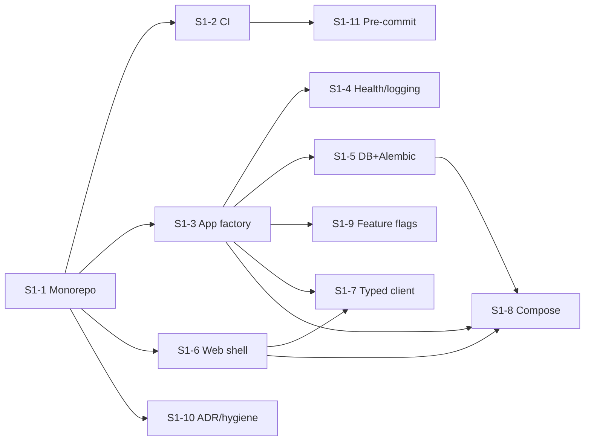

# 18 — Sprint 1 Task Breakdown (M1 · Foundations)

> **Status:** Planning only — no production code until approval.
> **Maps to:** doc 16 §M1, doc 17 §17.4 EPIC A. **Sprint length:** 2 weeks.
> **Capacity assumption:** one engineer alongside placement prep ≈ **20–24 story points**.
> **Estimation:** Fibonacci points (1,2,3,5,8) — relative effort incl. tests + docs.

---

## 18.1 Sprint Goal

> **Ship an empty-but-real, deployable CareerOS skeleton:** a monorepo where `docker compose up` starts a healthy FastAPI backend (`/health`, `/ready`) and a themed Next.js shell wired to a typed API client, backed by Postgres with a baseline Alembic migration — all gated by CI (lint, type, test, build) and governed by feature flags + ADRs.

**Why this sprint first:** it establishes every cross-cutting concern (CI, typing, error envelope, config, migrations, theming, flags, ADRs) *once*, so every later feature slice is pure product work. No business feature ships in Sprint 1 by design.

---

## 18.2 Sprint Scope (in / out)

**In scope:** repo + tooling + CI, backend app factory + config + error envelope + health/ready, DB base + first migration, frontend shell + design tokens + typed API client, Docker Compose, feature-flag core, ADR framework.

**Out of scope (later sprints):** auth, any domain module, CRI, dashboards, business endpoints, deployment to a cloud environment (preview deploy config is set up but real infra is Sprint-later).

---

## 18.3 Sprint Backlog (summary)

| Story | Title | Points | Priority | Depends on |
|-------|-------|:-----:|----------|-----------|
| S1-1 | Monorepo scaffold + tooling | 3 | Critical | — |
| S1-2 | CI pipeline (lint/type/test/build) | 3 | Critical | S1-1 |
| S1-3 | Backend app factory + config + error envelope | 3 | Critical | S1-1 |
| S1-4 | Health/readiness endpoints + structured logging | 2 | Critical | S1-3 |
| S1-5 | Database base + Alembic + baseline migration | 3 | Critical | S1-3 |
| S1-6 | Frontend shell + design tokens + light/dark | 3 | High | S1-1 |
| S1-7 | Typed API client generated from OpenAPI | 2 | High | S1-3, S1-6 |
| S1-8 | Docker Compose (api, web, db, redis) | 2 | High | S1-3, S1-5, S1-6 |
| S1-9 | Feature-flag core + gate helper | 2 | High | S1-3 |
| S1-10 | ADR framework + repo hygiene (templates, CODEOWNERS) | 1 | Medium | S1-1 |
| S1-11 | Pre-commit hooks + Conventional Commits enforcement | 1 | Medium | S1-1, S1-2 |
| **Total** | | **25** | | |

> If capacity is tight, **S1-11** (1pt) and **S1-9** (2pt) are the agreed de-scope candidates → pull to Sprint 2; core skeleton (S1-1…S1-8, S1-10 = 22pt) is the must-land set.

---

## 18.4 Stories → Tasks

Each story lists tasks, acceptance criteria (AC), and its Definition of Done inherits doc 16 §1.2 (tests + docs + green CI).

### S1-1 · Monorepo scaffold + tooling — 3pt · Critical
**Tasks**
- Initialize monorepo `careeros/` (Turborepo/npm workspaces) per doc 17 §17.4/doc 16 §5: `apps/web`, `apps/api`, `packages/{contracts,ui-tokens,config}`, `infra/`, `.github/`, `docs/`.
- Backend project: `pyproject.toml` (ruff, ruff-format, mypy strict, pytest), Python 3.12, `uv`/`pip-tools` lock.
- Frontend project: Next.js + TS strict, ESLint + Prettier, Vitest.
- Root `README.md`, `.gitignore`, `.env.example`, `CONTRIBUTING.md`/`CODING_STANDARDS.md` links.

**AC**
- Fresh clone → `make setup` (or documented commands) installs both stacks.
- `ruff`, `mypy`, `eslint`, `tsc --noEmit` all runnable and green on the empty scaffold.
- No secrets committed; `.env.example` documents required vars.

### S1-2 · CI pipeline — 3pt · Critical
**Tasks**
- `.github/workflows/ci.yml`: matrix jobs — backend (ruff, mypy, pytest+coverage) and frontend (eslint, tsc, vitest, `next build`).
- Cache deps; upload coverage artifact; fail on lint/type/test errors.
- Branch protection notes documented (required checks, no direct push to `main`).

**AC**
- PR opens → CI runs both stacks; red on any failure; green on the scaffold.
- Coverage reported (no threshold gate yet — introduced when domain logic exists).

### S1-3 · Backend app factory + config + error envelope — 3pt · Critical
**Tasks**
- `create_app()` factory; settings via Pydantic-Settings (`core/config.py`), env-driven, typed.
- Standard **error envelope** middleware + exception handlers (shape from `API.md`): `{ "error": { "code", "message", "details", "request_id" } }`.
- Request-ID middleware; CORS; router mounting at `/api/v1`.

**AC**
- Unknown route → 404 in the standard envelope; validation error → 422 in envelope.
- Config fails fast with a clear message when a required env var is missing.
- No `Any`/`getattr`/`setattr`; mypy strict passes.

### S1-4 · Health/readiness + structured logging — 2pt · Critical
**Tasks**
- `GET /health` (liveness, no deps) and `GET /ready` (checks DB + Redis).
- Structured JSON logging with request-id correlation; log level via config.

**AC**
- `/health` → 200 always; `/ready` → 503 with envelope when DB/Redis down, 200 when up.
- Logs are JSON, include `request_id`; no secrets/PII logged.
- Unit + API tests cover both endpoints (up and dependency-down paths).

### S1-5 · Database base + Alembic + baseline migration — 3pt · Critical
**Tasks**
- SQLAlchemy 2.0 typed `Base`, session/engine, `get_db` dependency.
- Alembic init; env wired to settings; naming conventions for constraints/indexes.
- **Baseline migration**: extensions (`pgcrypto`, `citext`, `pg_trgm`) + a minimal `app_meta`/`feature_flags` table (no domain tables yet — those arrive with their modules).

**AC**
- `alembic upgrade head` and `downgrade base` both succeed on a clean Postgres 16.
- Migration validated against real Postgres in CI (service container).
- Conventions documented in `DATABASE.md` (already), migration reviewed.

### S1-6 · Frontend shell + design tokens + light/dark — 3pt · High
**Tasks**
- Next.js App Router shell: root layout, app chrome (nav placeholder), error/loading/not-found boundaries.
- Tailwind + shadcn/ui init; **design tokens** in `packages/ui-tokens`; light/dark theme toggle (system default) with no flash.
- Base accessible primitives; axe check wired in Vitest/Playwright setup.

**AC**
- App renders shell in light and dark; toggle persists; no hydration/flash warning.
- Lighthouse/axe: no critical a11y violations on the shell.
- `next build` passes in CI.

### S1-7 · Typed API client from OpenAPI — 2pt · High
**Tasks**
- Generate TS types/client from backend OpenAPI into `packages/contracts`.
- Script (`gen:api`) + CI check that committed types match the current OpenAPI (drift fails CI).
- TanStack Query provider + a typed `useHealth()`/`useReady()` example call.

**AC**
- Frontend calls `/health` through the generated typed client (end-to-end wire proof).
- Changing the API without regenerating types **fails CI**.

### S1-8 · Docker Compose — 2pt · High
**Tasks**
- `docker-compose.yml`: `db` (postgres:16), `redis`, `api`, `web`; healthchecks; volumes; `.env` wiring.
- Migrations run on api start (or documented one-liner); dev hot-reload.

**AC**
- `docker compose up` → all services healthy; web reaches api `/health`; api `/ready` green.
- Documented in `DEVELOPMENT.md`; one-command bootstrap works from a clean machine.

### S1-9 · Feature-flag core — 2pt · High
**Tasks**
- `core/feature_flags.py`: config/DB-backed flags; `is_enabled(flag, user?)` helper; typed flag registry.
- Backend dependency + frontend hook to read flags; default-off for all V2/AI surfaces.

**AC**
- A sample flag toggles a stub endpoint/route on/off without redeploy (config or DB row).
- Unit tests cover enabled/disabled/unknown-flag behavior (unknown → off).

### S1-10 · ADR framework + repo hygiene — 1pt · Medium
**Tasks**
- Confirm `docs/ADR/` template + ADR-0001…0005 (already authored) are linked from `CONTRIBUTING.md`.
- Add `.github/ISSUE_TEMPLATE/`, `PULL_REQUEST_TEMPLATE.md`, `CODEOWNERS`, Dependabot config.

**AC**
- New PRs get the template + review checklist; CODEOWNERS routes reviews.
- ADR process documented; adding an ADR is a one-file, numbered step.

### S1-11 · Pre-commit + Conventional Commits — 1pt · Medium
**Tasks**
- `.pre-commit-config.yaml`: ruff, ruff-format, mypy (fast), eslint/prettier, end-of-file/trailing-whitespace, detect-secrets.
- commitlint (or commit-msg hook) enforcing Conventional Commits.

**AC**
- `git commit` runs hooks; a non-conventional message or lint error is rejected locally.
- Hooks documented; `pre-commit install` in setup steps.

---

## 18.5 Dependency order (build sequence)

**Suggested PR slicing (small, reviewable):**
1. PR#1 S1-1 (+S1-10 hygiene, S1-11 hooks) · 2. PR#2 S1-2 CI · 3. PR#3 S1-3 app factory + error envelope · 4. PR#4 S1-4 health/logging · 5. PR#5 S1-5 DB+migration · 6. PR#6 S1-6 web shell/tokens · 7. PR#7 S1-7 typed client · 8. PR#8 S1-9 flags · 9. PR#9 S1-8 compose (ties it together).

---

## 18.6 Sprint Definition of Done (exit criteria)

Sprint 1 is complete only when **all** hold:
1. `docker compose up` yields healthy `api` + `web` + `db` + `redis`; `/health` 200, `/ready` 200.
2. Web shell renders (light/dark) and calls the backend via the **generated typed client**.
3. `alembic upgrade head`/`downgrade base` succeed on Postgres 16, validated in CI.
4. CI green: ruff, mypy strict, eslint, tsc, pytest, vitest, `next build`; OpenAPI-type drift check passes.
5. Error envelope, request-id, structured logging, config-fail-fast in place and tested.
6. Feature-flag helper works (sample flag toggles a surface).
7. Repo hygiene live: PR/issue templates, CODEOWNERS, Dependabot, pre-commit + Conventional Commits.
8. `README.md`, `DEVELOPMENT.md`, `CHANGELOG.md` (Unreleased) updated; ADRs linked.
9. Every story merged via its own small PR; `main` releasable.

---

## 18.7 Risks & mitigations

| Risk | Mitigation |
|------|------------|
| Tooling/CI yak-shaving eats the sprint | Timebox S1-2; land backend CI first, frontend CI second; keep gates minimal (no coverage threshold yet). |
| OpenAPI type-gen flakiness | Pin generator version; make drift check advisory for PR#7, blocking once stable. |
| Compose healthcheck ordering | Explicit `depends_on: condition: service_healthy`; retry `/ready`. |
| Scope creep (adding auth "while here") | Auth is Sprint 2 (M2); Sprint 1 ships *no* domain features by design. |
| Solo capacity vs. placement prep | 22pt must-land core; S1-9/S1-11 are pre-agreed de-scope to Sprint 2. |

---

## 18.8 What Sprint 2 will be (preview)

**M2 · Authentication & Accounts** (doc 17 EPIC B): register/login/refresh/logout, RBAC + ownership, profile CRUD, OAuth2 (Google/GitHub), rate-limit + audit — the first real vertical slice on top of this foundation.

> On approval, implementation begins with **PR#1 (S1-1)**. No production code is written before then.
